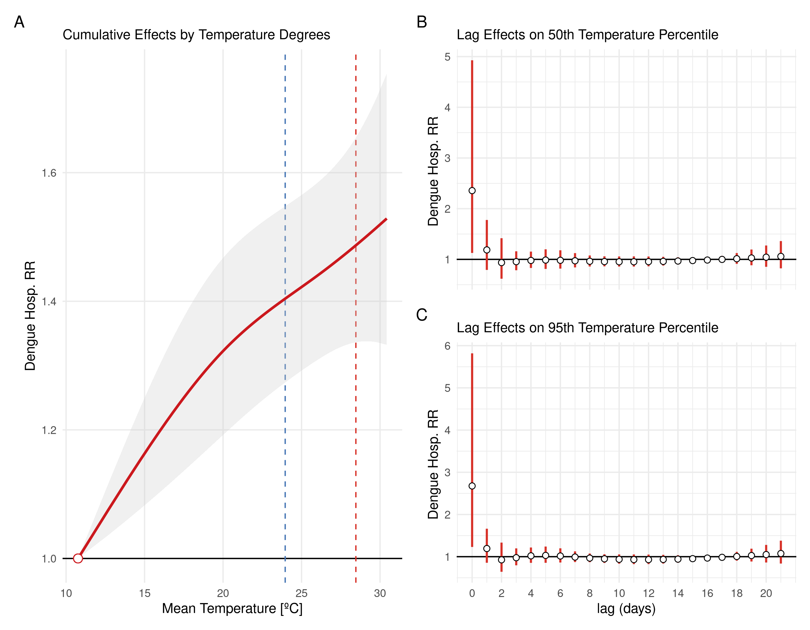

layout: true

```{r setup, include=FALSE}
options(htmltools.dir.version = FALSE)
knitr::opts_chunk$set(echo = FALSE)
```

```{r xaringan-themer, include = FALSE}
options(htmltools.dir.version = FALSE)
library(xaringanthemer)
library(xaringanExtra)
library(knitr)
library(DT)
library(RefManageR)
library(icons)
duo_accent(
  primary_color = "#A70000",
  secondary_color = "#ff0000",
  white_color = "white",
  header_font_google = google_font("Roboto Condensed"),
  text_font_google   = google_font("Roboto Condensed", "300", "300i"),
  code_font_google   = google_font("Ubuntu Mono"), text_font_size = "30px")
use_extra_styles(
  hover_code_line = TRUE, 
  mute_unhighlighted_code = TRUE)
```

---

class: left

## Find me at

.left-column[

`r fontawesome::fa("github")` GitHub: [https://github.com/rafalopespx/](https://github.com/rafalopespx/)

`r fontawesome::fa("mail-bulk")` e-Mail: [lopes1313@gmail.com](mailto:lopes1313@gmail.com)

`r fontawesome::fa("twitter")` Twitter: [@rafalpx](www.twitter.com/rafalpx)

]

.pull-right[


]

---

## About me

+ Ph.D. Candidate in Physics, in the Instituto de Física Teórica - IFT/ UNESP-SP

+ Bachelor in Physics by UNICAMP (2014), Master in Physics by IFT/UNES-SP (2018)

+ With a exchange period (2021-2022), in the Barcelona Institute for Global Health (ISGlobal), at Barcelona.

---

## Summary

This presentation is divided into 4 main parts:

 * Historical background on Dengue
 
 * Ecological analysis of Dengue data and climate data
 
 * Epidemiological analysis of Dengue data and temperature data
 
 * Final remarks
 
---

## Research questions

The thesis has two main questions that tries to answer:

 * In the Ecological part: **How temperature and precipitation affects the variability of Dengue cases in a major city of Brazil?** 
 The study covers 10 years (2010 - 2019) of Dengue incidence
 
 * In the Epidemiological part: **How temperature is associated with higher levels of Dengue hospitalizations in Brazil?**
 The study covers 10 years (2010 - 2019) of Dengue hospitalization incidence
 
---

## Historical Background

Dengue has been a major problem on Brazil during the 20th Century:

  - First records of Dengue in Brazil starts on the last decades of the 19th century
  
  - The main vector of Dengue, _Aedes Aegypti_ got locally eliminated, but was reintroduced in the 1970s
  
  - Since then, Dengue has continuously rising in incidence and dispersion over the Brazillian territory
  
  - Since 2001, a system of notification dedicated and surveillance specific to the disease was build

---

## Dengue Disease

  - vector borne disease, human-mosquito-human cycle

  - incubation period of four- to six-day and persists until around the time fever abates, which is typically three to seven days, potential of cryptic transmissions

  - Hyperendemic disease in Brazil, with anual cycles of outbreaks

---

## Data sources:

  - From the _Sistema de Informação de Agravos de Notificação_ (SINAN), system more prompt to notify symptomatic mild cases  of Dengue, were aggregated by municipality, health regions, states, and/or any aggregation that is more suitable to the amount of cases.
  
  - From the _Sistema de Informação Hospitalares_ (SIH), system more prompt to notify severe cases of Dengue, were aggregated by municipality, health regions, states, and/or any aggregation that is more suitable to the amount of cases.

  - For the climate variable, we used the gridded daily ECVs taken from reanalysis products (ERA5-Land) 

  - From the raw ECVs were produced a weighted mean area aggregation over the municipalities (health regions, states, etc.) extent area, to create matching time series for each aggregation level.

---

## Characteristics of Dataset

  - ~11.0 million of individual cases confirmed for Dengue, with information of Sex, Age, Municipality of Residence, from 2001 to 2020

  - Sparse data before 2000, due to non obligatory notification, more consistent data after 2001

  - With the majority of cases in the Southeast region and Northeast regions, ~5.7 millions and ~2.2 million cases, respectively
  
---

## Characteristics of Dengue epidemics


  - Strong seasonality, right after the rainy season, relation with mosquito life cycle

  - Hyperendemicity, endemic epidemics outbreaks of four different serotypes
  
  - More recently, since 2020, raising on incidence and spread to the South region
  
---

```{r endemicity, echo=FALSE, message=FALSE, warning=FALSE, out.width=800, fig.align='center'}
knitr::include_graphics("img/dengue_cases_regions_after_2001.png")
```

---

class: middle, center

# Ecological analysis

---

## Objectives and Questions

**How Temperatures & Total Preciptations affects the counts of Cases due to Dengue in Brazil, during 2010-2019?**

Objectives: 

-1) To quantify climate drivers by *EDM* of temperature and precipitation on counts of cases due to Dengue

-2) Understand which are the climatic drivers and how much they force on cases

---

## Empirical Dynamic Modelling

Framework to analyse time series seeking for causality between them:

- From the Takens Theorem we can reconstruct any dynamical system by any observation and its delays

---

```{r takens theorem, echo=FALSE, message=FALSE, warning=FALSE, out.width=800, fig.align='center'}
knitr::include_graphics("img/Takens Theorem.png")
```

---

## Empirical Dynamic Modelling

Framework to analyse time series seeking for causality between them:

- From the Takens Theorem we can reconstruct any dynamical system by any observation and its delays

- This reconstruction it is called __Shadow-Manifold__, it maps complete the dynamics into the original Manifold

---

```{r state space, echo=FALSE, message=FALSE, warning=FALSE, out.width=800, fig.align='center'}
knitr::include_graphics("img/State Space Reconstruction.png")
```

---

## Empirical Dynamic Modelling

Framework to analyse time series seeking for causality between them:

- From the Takens Theorem we can reconstruct any dynamical system by any observation and its delays

- This reconstruction it is called __Shadow-Manifold__, it maps complete the dynamics into the original Manifold

- Any two __Shadow-Manifolds__ that maps each other are __Causal__ linked

---

```{r causality, echo=FALSE, message=FALSE, warning=FALSE, out.width=800, fig.align='center'}
knitr::include_graphics("img/Causality.png")
```

---

## Dengue in Rio de Janeiro city

Typical procedure of *EDM*

  1) Extract the seasonality of the drivers, make a distribution of surrogate time series.

  2) Do the CCM with the Original time-series and 500 Surrogates series with the same seasonality pattern
  
  3) Repeat for different values of time for predicition $tp$

  4) Where in the $tp$ the Original is above the 0.95th percentile of the $\rho_{CCM}$ distribution for the 500 Surrogates time-series, it is significant causal relation

  5) Estimate the force of causality for the drivers at the time for prediction with highest $\rho_{CCM}$ by applying S-Map

---

```{r rj-plot, echo=FALSE, message=FALSE, warning=FALSE, out.width=800, fig.align='center'}
knitr::include_graphics('img/cases_rj.png')
```

---

## Extracting seasonality & Surrogate making

The algorithm we use is:

 - Fit a cubic smooth spline to each climate driver, this gives a seasonal component to each driver
 
 - substract this seasonality pattern from the original driver time series
 
 - The residuals are shuffled yearly and after is added the seasonality pattern
 
 - This new surrogate time series for the climate driver, has the same seasonal pattern but different residuals
 
 - Make 500 of this surrogates series

---

```{r rj-precip-season, echo=FALSE, message=FALSE, warning=FALSE, out.width=700, fig.align='center'}
knitr::include_graphics('img/patch_pattern_seasonality.png')
```

---

## Surrogate statistical test

To create each surrogate time series, we pick the seasonality pattern and add a sample of residuals randomly shuffled:

 - This creates a surrogate time series for the driver, with the same seasonal pattern but different values
 
 - When putting this on the CCM function, we ask if the seasonal pattern is driving the dynamics, if yes, the surrogates will have a better prediction skill then the original time series
 
 - The dynamics will them linked to the seasonality of the driver and not to the climate driver itself

---

```{r, echo=FALSE, message=FALSE, warning=FALSE, out.width=700, fig.align='center'}
knitr::include_graphics('img/patch_final_surrogates.png')
```

---

## Surrogates testing

Now we want to find where in the time for prediction, $tp$, the original driver is most significant causal:

 - We apply CCM on the 500 surrogates and the Original time series for various $tp$ values, of maximum 17 weeks of delay
 
 - Where the Original driver time series is above the 95th percentile of the distribution it causally significant

---

```{r rj-boxplot-tps, echo=FALSE, message=FALSE, warning=FALSE, out.width=700, fig.align='center'}
knitr::include_graphics('img/yearly_shuffle_boxplot_17_weeks_tp_type.png')
```

---

## Surrogates testing

 - Where the original driver has a value of cross-mapping skill higher the 95th percentile of the distribution we color it in red
 
 - We repeat this procedure of identifiying where the original driver is stastistically significant through over all the $tp$ values tested
---

```{r rj-boxplot-sig, echo=FALSE, message=FALSE, warning=FALSE, out.width=700, fig.align='center'}
knitr::include_graphics('img/yearly_shuffle_boxplot_drivers_tp_sig_17_weeks.png')
```

---

## Force of Interaction

With the climate driver and the time for prediction where the original driver is causal significant and where it is has the greater $\rho$ we estimate the force of interaction:
 
 - Using the S-Map algorithm, we estimate the effect of the driver, at the $tp$, on the time series of Cases
 
 - S-Map is a non-parametric method of locally weighted Jacobian Element for the prediction of the cases time-series from the climate drivers SSR

---

## Force of Interaction
 
The S-Map has the following formula, which it is a Singular Value Decomposition (SVD) algorithm:

$$
\begin{equation}
Cases(t) = \mathbf{C_0} + \sum_{i=1}^{I} \mathbf{C_i}(t) x_i(t),
\end{equation}
$$

Where $I$ is until the drivers we found as significant causal on the Cases time series. We choose the minimum value of Mean Absolute Error (MAE), between predictions and observations given by the S-Map for $\theta$. Where $C_i$ are weights to pounder how great are the influences of each nearby point on the predicted point.

---

## Theta form

$\theta$ it is the locally weighted kernel to the decay of influence of each point considered into the prediction, with the formula: 

$$C_i = \exp^{-\theta\frac{\|x(t_k) - x(t)\|}{d}}$$

If $\theta$ is $0$ or close to $0$ the model understand the influence of each driver as linear, as $\theta$ grows the model gives more non-linearity weight to each of the drivers.

---

```{r theta, echo=FALSE, message=FALSE, warning=FALSE, out.width=700, fig.align='center'}
knitr::include_graphics('img/yearly_shuffle_tp_17_theta_min_mae_rmse.png')
```

---

## S-Map Models

We then employ the following model to the force of interaction estimation:

$$
\begin{multline}
Cases(t) = \mathbf{C_0} + \frac{\partial Cases(t)}{\partial Precip_{max}(t-2)}Precip_{max}(t-2)+ \\
\frac{\partial Cases(t)}{\partial Precip_{min}(t-7)}Precip_{min}(t-7)
\end{multline}
$$

Where $C_0$ is a constant term and the folliwng terms are the coeffcients to be estimated locally over the SSR constructed with the time-series $Cases(t),Precip_{min}(t-7), Precip_{max}(t-2)$

---
 
```{r foi, echo=FALSE, message=FALSE, warning=FALSE, out.width=750, fig.align='center'}
knitr::include_graphics('img/patchwork_coef_precip_tp_17.png')
```

---

## Conclusion & Interpretation

 * __Temperatures__ are climate drivers of Cases at Rio de Janeiro city, but them drives cases in the city by its seasonality and not by its variability, due to not being found as drivers by CCM. So they are a conditions that is matched by a season on year.

 * __Maximum Precipitation__ has an lagged effect on cases of 2 weeks, and it decreases with the rising of maximum amount precipitation, we understand it as being a driver that has a saturation effect on the forcing, flushing effects on mosquito life cycle.
 
 * __Minimum Precipation__ has a lagged effect on cases of 7 week, in the same shape as Max. Preciptation, after drought any amount of precipitation helps the mosquito cycle. 
 
 * Precipitations drives the cases by variability at the right conditions.
 
---

class: middle, center

# Epidemiological analysis

---

## Objectives and Questions

**How ambient temperature affects the counts of hospitalization due to Dengue, during the period of 2010-2019?**

Objectives: 

 - To quantify association of daily ambient temperature and counts of hospitalization due to Dengue

---

## Data sources and definitions:

  - We used the Brazil national database of authorization for hospitalization (AIH), filtered for the ICD-10 codes, ’A90’, ’A91’, ’A97’, ’A970’, ’A971’, ’A972’, ’A979’, for the hospitalization cases of Dengue, aggregated by municipality.

  - For the climate variables, we used the gridded daily temperature taken from reanalysis products (ERA5Land) 

  - We have done a weighted mean area aggregation over the municipality extent area, to create matching time series for each municipality.

---

## Study Design

We did a two-stages design, to the association of the daily mean temperature and counts of hospitalization due Dengue.

+ First stage: A "Time Stratified" design for the aggregated level of a each of 27 states, with a stratum for each municipality within a state, day of the week and the month on the time series.

+ Second stage: Multivariate Meta-analysis for the coefficients fitted and the Covariance matrix, in two levels of aggregation, for the whole country and for the 5 macro regions of Brazil. 
      
      - The model on this level was a multivariate random effects model ran by a restricted maximum likelihood estimator.
      
---

## Model specification, First stage

<!-- Before desribing the model itself, we settle down some concepts on statistical models used. When describing a model we construct it from the likelihood we suppose it gives the distribution of the data.  -->
In this study we suppose the Dengue hospitalization counts in the city $i$ at time $t$ is given by a $Poisson(\lambda_{i,t})$ distribution, with the conditional that $Y_{.,t} = \sum_i Y_{i,t}$, an alternative formulation of an $quasiPoisson$ distribution to account for overdispersed data:

$$
\begin{equation}
Y_{i,t} \sim quasiPoisson(\lambda_{i,t},\psi)
\end{equation}
$$

Where the $\lambda_{i,t}$ and $\psi$ is the parameter to control overdispersion, and we choose a log fucntion for the link-function

---

## Model specificatio, First Stage

On each of 27 states, we run a Conditional Poisson model, for the association between Dengue hospitalizations time series and mean temperature for each municipality:

$$log[\lambda_{i,t}] = \xi_{t,i} + f(x_{t,i},l) + \sum_{k=1}^{K}s_k(t)$$

Where $Y_{t,i}$ is as before the count of cases at $t$ on the i-th municipality, $\xi_{t,i}$ the dow-month-city strata term conditioned out. $f(x_{t,i}, l)$ which is the __DLNM__ for mean temperature on the state by each day of delay, until 21 days of lags. The last term is the long-term trend modelling choice for temperature trend along the whole period, a natural spline with 7 degrees of freedom by year on the whole period.

---

## Crossbasis Parametrization

The *cross-basis* were parametrized as the standard in __DLNM__ for mean temperature: 

 + A *natural splines* with 2 knots equally spaced on the range of mean temperature,
 for the structure to the doses-response
 
 + A *natural spline* with 3 knots equally spaced on the log-scale for the lag-response structure
 
 + 0 to 21 days of lags

---

## Geographical Variation

Why we make use of such models? Because enviromental exposures has two main features that needs atention to be drawned:

  + Normally, exposures varies in a narrow range, environmental exposures like temperature __not__, it varies along different locations.

  + Normally, exposures have a very short time-window of action, environment exposures __not__, it can acts all the time for the all the subjects.

---

```{r geo, echo=FALSE, message=FALSE, warning=FALSE, out.width=800, fig.align='center'}
knitr::include_graphics("img/geo_temp_inset.png")
```

---

## Second Stage

For the second stage we choose a multivariate meta-analysis model, on each meta-analysis level, whole country or by macro region, with the following formulation:

$$\hat{\theta_i} | u_i \sim N_k (\theta + u_i , S_i ),
u_i ∼ N_k (\theta, \psi)$$

Where, $\hat{\theta_i}$ vector $k\times1$ combined effects to the estimate, 
$u_i$ vector $k \times 1$ random effects for coefficients of study $i$.
$S_i$ matrix $k \times k$ covariance matrix within studies for the study $i$ and $\psi$ matrix $k \times k$ covariance between studies, defined by $k(k + 1)/2$ variables $\xi$.

---

class: middle, center

# Second Stage Results, Whole Country Meta-analysis

---

```{r brasil-overal-absolute, echo=FALSE, message=FALSE, warning=FALSE, out.width=800, fig.align='center'}

```

---

class: middle, center

# Second Stage Results, Regions Meta-analysis

---

```{r regions-overall-absolute, echo=FALSE, message=FALSE, warning=FALSE, out.width=800, fig.align='center'}
knitr::include_graphics("img/plot_overall_regions_all_regions_gnm_meta.png")
```

---

## Table Summary

```{r table-summary, echo=FALSE, message=FALSE, warning=FALSE, out.width=800}
table<-vroom::vroom(file = "../Xaringan_defense/Tables/table_1_mht_RR_absolute.csv")
table<-table %>% 
  setNames(c("State", "MHT", "RR 5th (IC 95%)", "RR 95th (IC 95%)"))
rmarkdown::paged_table(table)
```

---

## Conclusion & Interpretation

  * The main finding is that are higher risk of being hospitalised by Dengue as the temperature gets higher.
    * After 20 degrees Celsius, the risk is 1·2x higher than for the minimum temperature observed (10·8 º C)
  
  * We found a stronger immediate effect on the RR to the hospitalisation. 

  * We found the same patterns over each macro region of Brazil for the general association between RR hospitalisation and ambient temperature. 
  
---

class: middle, center

# Final Remarks and Next steps


---

## Summary

On a general view, this thesis has studied the dynamics of mild to severe cases of Dengue in Brazil, during the a period of 10 years, from 2010 to 2019.

  - In the first part, we investigated how temperature and precipitation drives the dynamics of cases in a major city that has a historical of endemicity od Dengue, for the cited period.
  
    * Main finding is that precipitation is a driver of the dynamics of cases through the variability of the time-series, and it has a lagged relation for this forcing, being 2 weeks lagged for the maximum precipitation and 7 weeks for the minimum precipitation
    
    * Secondary finding, is that temperature has a whole on the dynamics of dengue cases through seasonality

---

class: middle, center

# Other publications

---

## List of publications

---

class: middle, center

# Thank You!
# ¡Gracias!
# Obrigado!

`r fontawesome::fa("github")` GitHub: [https://github.com/rafalopespx/](https://github.com/rafalopespx/)
`r fontawesome::fa("mail-bulk")`  [lopes1313@gmail.com](mailto:lopes1313@gmail.com)
`r fontawesome::fa("twitter")` Twitter: [@rafalpx](www.twitter.com/rafalpx)

---

## Model specification, First stage

<!-- Before desribing the model itself, we settle down some concepts on statistical models used. When describing a model we construct it from the likelihood we suppose it gives the distribution of the data.  -->
In this study we suppose the Dengue hospitalization counts in the city $i$ at time $t$ is given by a $Poisson(\lambda_{i,t})$ distribution, with the conditional that $Y_{.,t} = \sum_i Y_{i,t}$, this actually is a $Multinomial$ model as below, which we use an alternative formulation of an $quasiPoisson$ distribution to account for overdispersed data:

$$
\begin{equation}
Y_{i,t}|Y_{.,i} \sim Multinomial(\pi_{i,t}) \equiv quasiPoisson(\lambda_{i,t},\psi)
\end{equation}
$$

Where $\pi_{i,t}$ is given by the relation $\pi_{i,t} = \frac{\exp(\boldsymbol{\beta^T\boldsymbol{x_i}})}{\sum_{j\in t}\exp{\boldsymbol{\beta^{T}\boldsymbol{x_j}}}}$ and equivalently for the $\lambda_{i,t}$, and we choose a log link-function
