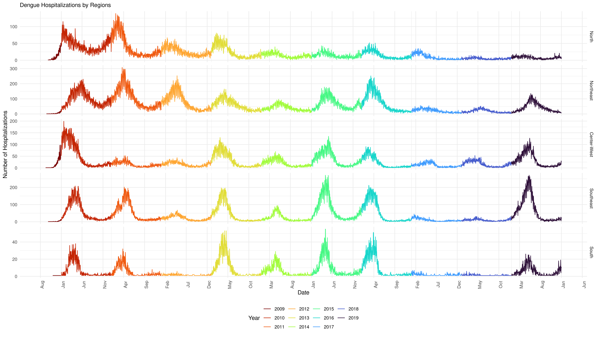
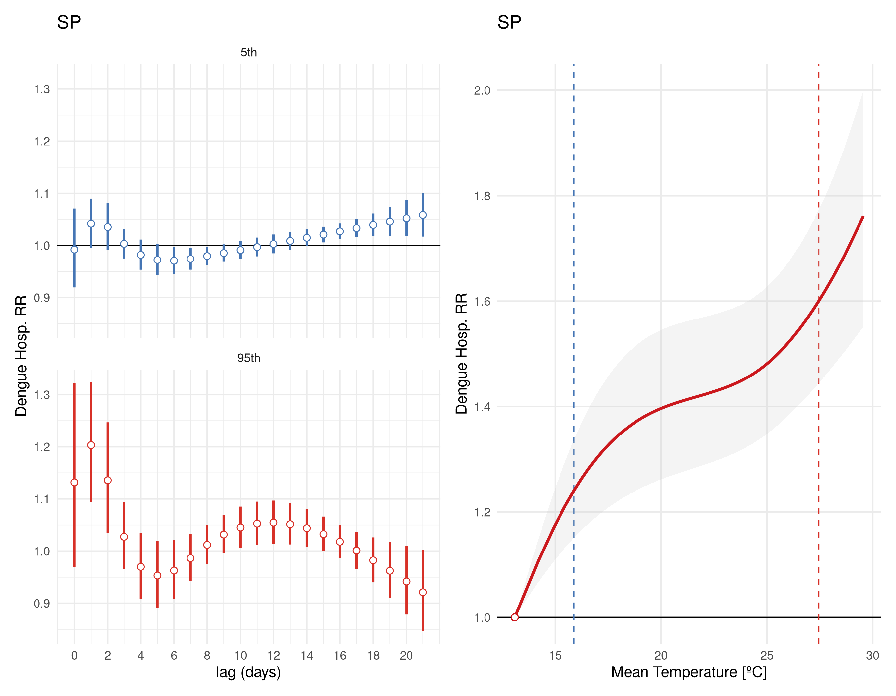

layout: true

```{r setup, include=FALSE}
options(htmltools.dir.version = FALSE)
knitr::opts_chunk$set(echo = FALSE)
```

```{r xaringan-themer, include = FALSE}
options(htmltools.dir.version = FALSE)
library(xaringanthemer)
library(xaringanExtra)
library(knitr)
library(DT)
library(RefManageR)
library(icons)
duo_accent(
  primary_color = "#A70000",
  secondary_color = "#ff0000",
  white_color = "white",
  header_font_google = google_font("Roboto Condensed"),
  text_font_google   = google_font("Roboto Condensed", "300", "300i"),
  code_font_google   = google_font("Ubuntu Mono"), text_font_size = "30px")
use_extra_styles(
  hover_code_line = TRUE, 
  mute_unhighlighted_code = TRUE)
```

---
class: left

## Find me at

.left-column[

  `r fontawesome::fa("github")` GitHub: [https://github.com/rafalopespx/](https://github.com/rafalopespx/)
  
  `r fontawesome::fa("mail-bulk")` [lopes1313@gmail.com](mailto:lopes1313@gmail.com)
  
  `r fontawesome::fa("twitter")` Twitter: [@rafalpx](www.twitter.com/rafalpx)

]

.pull-right[

  

]

---

## Objectives and Questions

**How ambient temperature affects the counts of hospitalization due to Dengue, during the period of 2010-2019?**

Objectives: 

 -1) To quantify association of daily ambient temperature and counts of hospitalization due to Dengue

 -2) To quantify confounding effects of humidity on the association of daily ambient temperature and counts of hospitalization due to Dengue

---

## Dengue Disease

 -1) vector borne disease, human-mosquito-human cycle
 
 -2) Viremia in humans begins toward the end of a four- to six-day incubation period and persists until around the time fever abates, which is typically three to seven days
 
 -3) One of main determinants of severe disease is the Capillary leak syndrome, which might be affected by temperature

---

## Data sources and definitions:

- We used the Brazil national database of authorization for hospitalization (AIH), filtered for the hospitalization cases of Dengue, aggregated by municipality, or health region, or any aggregation that is more suitable to the amount of cases.

- For the climate variable, we used the gridded daily temperature taken from reanalysis products (ERA5Land) 

- We does a weighted mean area aggregation over the municipality extent area, to create matching time series for each municipality.

<!-- The spatial aggregation for sampling the climate data was a buffer of 0.01º square around the point localized for the health unit, given by CNES code. -->
<!-- The localized down scaling was done by kriging the mean temperature with the altitude height data taken by the USGS DEM database. -->

<!-- --- -->

<!--  -->

---



<!-- --- -->

<!--  -->

<!-- --- -->

<!--  -->

---

## Study Design

We did a two-stages design, to the association of the daily mean temperature and counts of hospitalization due Dengue.

+ First stage: A "Time Stratified" design for the aggregated level of a each of 27 states, with a stratum for each municipality within the state and the month on the time series.

+ Second stage: Multivariate Meta-analysis for the coefficients fitted and the Covariance matrix, in two levels of aggregation, for the whole country and for the 5 macro regions of Brazil. 
      
      - The model on this level was a multivariate random effects model ran by a restricted maximum likelihood estimator.
      
---

## First Stage

On each of 27 states, we run a Conditional Poisson model, over the state level stacked time series of cases and mean temperature for each municipality:

$$g[E(Y_{tij})] = \xi_{tij} + f(x_{tij},l,\theta_j) + \sum_{j=1}^{J}s_k(t ;j)$$

Where $Y_{tij}$ is the count of cases by the j-th state on the i-th municipality, $\xi_{tij}$ the month-city strata term conditioned out. $f(x_{tij}, l, \theta_j)$ which is the __DLNM__ for mean temperature on the j-th state by each day of delay, until 21 days of lags. The last term is the long-term trend modelling choice for temperature trend along the whole period, a natural spline with 7 degrees of freedom by year on the whole period.

---

## Crossbasis Parametrization

The "cross-basis" were parametric as the standard in __DLNM__ for mean temperature: 

 + A *natural splines* with 2 knots placed on the 33th and 66th, percentile of mean temperature,
 for the structure to the doses-response
 
 + A *natural spline* with 3 knots equally spaced on the log-scale for the lag-response structure
 
 + 0 to 21 days of lags

---

## DLNM 101

To analyse this data we used the framework of __DLNM__, **D**istributed **L**ag **N**on-linear **M**odels, a framework developed to deal with delayed effects to an exposure:

+ It can deal with complex relation between exposures and Outcome

+ Environmental exposures vary greatly, so we need a framework that adapt to it flexibly

+ Environmental exposures has temporal and geographical variations, __DLNM__ is constructed to it

---

## Geographical Variation

+ Normally exposures varies in a narrow range, environment exposures like temperature __not__, it varies along different locations.

+ Normally exposures have a very short time-window of action, environment exposures __not__, it acts all the time for the all the subjects.

---

```{r geo, echo=FALSE, message=FALSE, warning=FALSE, out.width=800, fig.align='center'}
knitr::include_graphics("img/geo_temp_inset.png")
```

---

## Splines 101

To define a spline on an interval $[a, b]$, let $a ≤ t1 < t2 < · · · < tk ≤ b$ be the knot locations. A spline of order $q + 1$ is a q-th degree polynomial on each of the intervals $(tl , tl+1 )$. That is, let:

$$Pl (x) = β_0l + β_{1l} x + · · · + β_{ql} x^{q}$$

Then the spline $Q(x) = Pl (x)$ if $x ∈ (tl , tl+1 )$. For a spline of order $q + 1$, usually the continuity constraints at the knots specify that the function is continuous, and that the derivatives through order $q − 1$ are also continuous.

---

## Crossbasis 101

With splines: $s_1$, spline that models the __doses-response__ structure with dimension $vx$ and $s_2$, spline with dimension $νl$ for the __lag-response__:

$$Y = s_1(X_0) + s_1(X_{(−1)}) + ... + s_1(X_{(−L)}) + ε \\ R = s_2 ((0, ..., l, ...L))$$

to be used as a covariates on models, like a __GLM__, __GAM__, __GNM__, etc

---

## Crossbasis 102

Defining the array $\dot{D}_{n×ν_x×(L+1)}$ tridimensional:

$$Y = \sum^{\nu_x}_{i=1} \dot{D}·i·R\eta_{i} + \epsilon = \sum^{\nu_{x}}_{i=1}W_i\eta_i+\epsilon \\ W = [W_1, ..., W_{\nu_x}]$$

Where $W$ is the __cross-basis__, a bi-dimensional space generated by the basis functions choose to model the __doses-response__ and __lag-response__ structures

<!-- --- -->

---

class: middle, center

## First Stage Results

+ GNM, with Conditional Poisson model, eliminate on the month_city strata

+ Stacked all municipality by State

---

```{r each-state, echo=FALSE, message=FALSE, warning=FALSE, out.width=800, fig.align='center'}
knitr::include_graphics("img/gnm_absolute_scale_all_state_overall_effects.png")
```

---

```{r each-state-relative, echo=FALSE, message=FALSE, warning=FALSE, out.width=800, fig.align='center'}

```

---

```{r each-state-cold, echo=FALSE, message=FALSE, warning=FALSE, out.width=800, fig.align='center'}
knitr::include_graphics("img/gnm_all_state_cold_5th_effects.png")
```

---

```{r each-state-heat, echo=FALSE, message=FALSE, warning=FALSE, out.width=800, fig.align='center'}

```

---

## Second Stage

For the second stage we choose a multivariate meta-analysis model, on each meta-analysis leve, whole country or by macro region, with the following formulation:

$$\hat{\theta_i} | u_i \sim N_k (\theta + u_i , S_i ),
u_i ∼ N_k (\theta, \psi)$$

Where, $\hat{\theta_i}$ vector $k\times1$ combined effects to estimate, 
$u_i$ vector $k \times 1$ random effects for coefficients of study $i$.
$S_i$ matrix $k \times k$ covariance matrix within studies for the study $i$ and $\psi$ matrix $k \times k$ covariance between studies, defined by $k(k + 1)/2$ variables $\xi$.

---

class: middle, center

## Second Stage Results, Whole Country Meta-analysis

+ Random Effects mixed model

+ Fitted by a REML

---

```{r brasil-overall, echo=FALSE, message=FALSE, warning=FALSE, out.width=800, fig.align='center'}

```

---

```{r brasil-overal-absolute, echo=FALSE, message=FALSE, warning=FALSE, out.width=800, fig.align='center'}

```

---

```{r brasil-lag, echo=FALSE, message=FALSE, warning=FALSE, out.width=800, fig.align='center'}

```

---

```{r brasil-blups-meta, echo=FALSE, message=FALSE, warning=FALSE, out.width=800, fig.align='center'}

```

---

```{r brasil-blups-absolute, echo=FALSE, message=FALSE, warning=FALSE, out.width=800, fig.align='center'}

```

---

class: middle, center

## Second Stage Results, Regions Meta-analysis

+ Random Effects mixed model

+ Fitted by a 'REML' 

---

```{r regions-overall, echo=FALSE, message=FALSE, warning=FALSE, out.width=800, fig.align='center'}

```

---

```{r regions-overall-absolute, echo=FALSE, message=FALSE, warning=FALSE, out.width=800, fig.align='center'}

```

---

```{r regions-lag, echo=FALSE, message=FALSE, warning=FALSE, out.width=800, fig.align='center'}

```

---

```{r regions-blus-meta, echo=FALSE, message=FALSE, warning=FALSE, out.width=800, fig.align='center'}

```

---

```{r regions-blus-meta-absolute, echo=FALSE, message=FALSE, warning=FALSE, out.width=800, fig.align='center'}

```

---

## Table Summary

```{r table-summary, echo=FALSE, message=FALSE, warning=FALSE, out.width=800}
table<-vroom::vroom(file = "../Outputs/Tables/table_1_mht_RR.csv")
table<-table %>% 
  setNames(c("State", "MHT", "RR 5th (IC 95%)", "RR 95th (IC 95%)"))
rmarkdown::paged_table(table)
```

---

## Next Steps

+ Any other analysis to be run before start writing?

+ PAF to be calculated (On which level? Whole Country, by Region, by State?)

+ If ready, re-run the analysis with near-ground Relative Humidity

---
class: middle, center
# Thank You!
# ¡Gracias!
# Obrigado!

`r fontawesome::fa("github")` GitHub: [https://github.com/rafalopespx/](https://github.com/rafalopespx/)
`r fontawesome::fa("mail-bulk")`  [lopes1313@gmail.com](mailto:lopes1313@gmail.com)
`r fontawesome::fa("twitter")` Twitter: [@rafalpx](www.twitter.com/rafalpx)

---

class: inverse

---

```{r RO, out.width=800, fig.align='center'}

```

---

```{r RO-relative, out.width=800, fig.align='center'}

```

---

```{r AC, out.width=800, fig.align='center'}

```

---

```{r AC-absolute, out.width=800, fig.align='center'}

```

---

```{r AM, out.width=800, fig.align='center'}

```

---

```{r AM-absolute, out.width=800, fig.align='center'}

```

---

```{r RR, out.width=800, fig.align='center'}

```

---

```{r RR-absolute, out.width=800, fig.align='center'}

```

---

```{r PA, out.width=800, fig.align='center'}

```

---

```{r PA-absolute, out.width=800, fig.align='center'}

```

---

```{r AP, out.width=800, fig.align='center'}

```

---

```{r AP-absolute, out.width=800, fig.align='center'}

```

---

```{r TO, out.width=800, fig.align='center'}

```

---

```{r TO-absolute, out.width=800, fig.align='center'}

```

---

```{r MA, out.width=800, fig.align='center'}

```

---

```{r MA-absolute, out.width=800, fig.align='center'}

```

---

```{r PI, out.width=800, fig.align='center'}

```

---

```{r PI-absolute, out.width=800, fig.align='center'}

```

---

```{r CE, out.width=800, fig.align='center'}

```

---

```{r CE-absolute, out.width=800, fig.align='center'}

```

---

```{r RN, out.width=800, fig.align='center'}

```

---

```{r RN-absolute, out.width=800, fig.align='center'}

```

---

```{r PB, out.width=800, fig.align='center'}

```

---

```{r PB-absolute, out.width=800, fig.align='center'}

```

---

```{r PE, out.width=800, fig.align='center'}

```

---

```{r PE-absolute, out.width=800, fig.align='center'}

```

---

```{r AL, out.width=800, fig.align='center'}

```

---

```{r AL-absolute, out.width=800, fig.align='center'}

```

---

```{r SE, out.width=800, fig.align='center'}

```

---

```{r SE-absolute, out.width=800, fig.align='center'}

```

---

```{r BA, out.width=800, fig.align='center'}

```

---

```{r BA-absolute, out.width=800, fig.align='center'}

```

---

```{r MG, out.width=800, fig.align='center'}

```

---

```{r MG-absolute, out.width=800, fig.align='center'}

```

---

```{r ES, out.width=800, fig.align='center'}

```

---

```{r ES-absolute, out.width=800, fig.align='center'}

```

---

```{r RJ, out.width=800, fig.align='center'}

```

---

```{r RJ-absolute, out.width=800, fig.align='center'}

```

---

```{r SP, out.width=800, fig.align='center'}

```

---

```{r SP-absolute, out.width=800, fig.align='center'}

```

---

```{r PR, out.width=800, fig.align='center'}

```

---

```{r PR-absolute, out.width=800, fig.align='center'}

```

---

```{r SC, out.width=800, fig.align='center'}

```

---

```{r SC-absolute, out.width=800, fig.align='center'}
knitr::include_graphics("img/gnm_SC_absolute_scale_stacked_state_overall_effects.png")
```

---

```{r RS, out.width=800, fig.align='center'}

```

---

```{r RS-absolute, out.width=800, fig.align='center'}

```

---

```{r MS, out.width=800, fig.align='center'}

```

---

```{r MS-absolute, out.width=800, fig.align='center'}

```

---

```{r MT, out.width=800, fig.align='center'}

```

---

```{r MT-absolute, out.width=800, fig.align='center'}

```

---

```{r GO, out.width=800, fig.align='center'}
knitr::include_graphics("img/gnm_GO_2knots_stacked_state_overall_effects.png")
```

---

```{r GO-absolute, out.width=800, fig.align='center'}
knitr::include_graphics("img/gnm_GO_absolute_scale_stacked_state_overall_effects.png")
```

---

```{r DF, out.width=800, fig.align='center'}

```

---

```{r DF-absolute, out.width=800, fig.align='center'}

```

---

```{r geo-rh, echo=FALSE, message=FALSE, warning=FALSE, out.width=800, fig.align='center'}

```
---

## Main questions to advance

We ran test to escalate the analysis:

- Ten random cities, it ran but it loose the majority

- For the one hundred most cities with cases, it ran but loose ≈10% of the sample

- For the two hundred most cities with cases, still looses ≈10% of the sample

- Probably when as we grow the number of cities it will looses more than 10% of the sample
---

## Main questions to advance

+ How to solve the problem of sparse data and mode fit?

.center[
   | PRO | CON
--------|---------|---------
Select some high caseload cities, 10 y | Model fitting, 10 years | Criteria to choose, Representativesness
Select some medium-high caseload, seasonal periods | Model fitting, representativeness | Loose non seasonal periods and years / Some difficult for criteria
Collapse cities in some hierarchical high level (macro/micro region) | Model fitting, likely whole country/10 years | Loose some granularity on exposure-outcome?
Macro/micro region by using conditional poisson | Model, 10 years, whole country | Model specification?

]

---

## Main Questions to Advance

```{r gasparrini, out.width=600, fig.align='center'}

```

---

## Main questions to advance:

+ How to parameterize the __cross-basis__, long-term trend?

.center[
  | cross-basis | Lag | long-term/seasonal
 --------|---------|---------
Use the commonly | Polynomial, 3 degree, Without intercept | NS, 3 knots, on the log-scale equally spaced, With intercept | NS, df=7*nyear + dow
Options | | | df=8*nyear? Dow?
]

---

## Main Questions to Advance:

+ Try to introduce different variables:

  - A __cross-basis__ for relative humidity?
  
  - A __cross-basis__ for total cases?