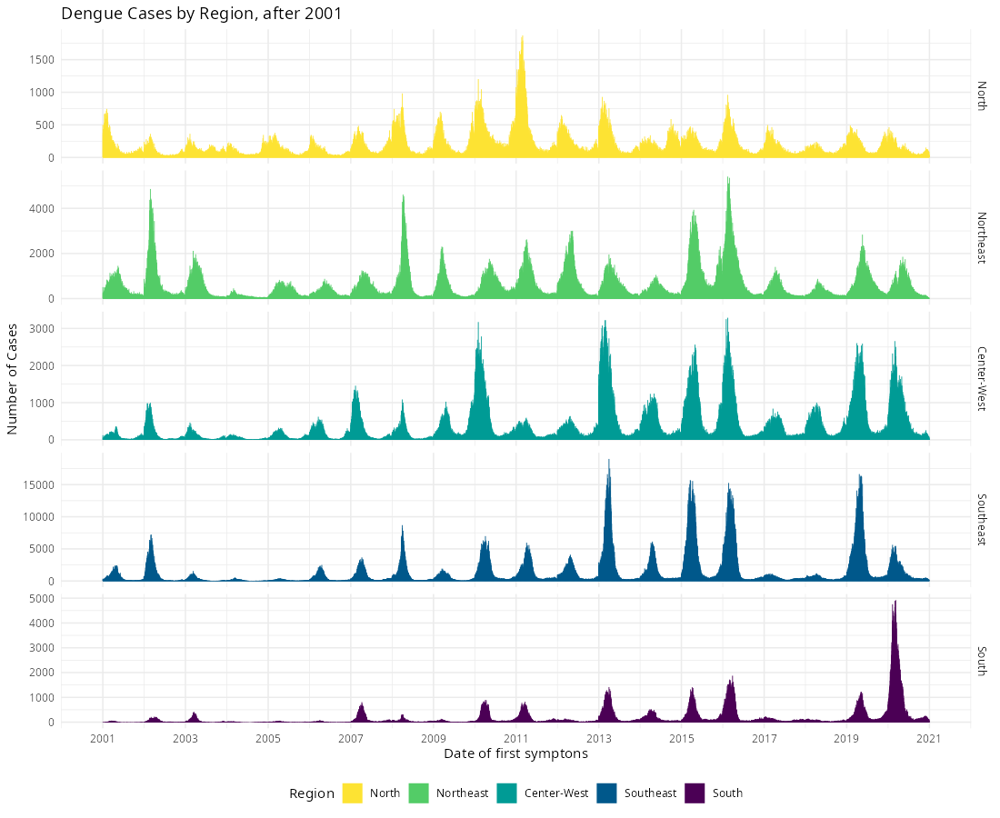

layout: true

```{r setup, include=FALSE}
options(htmltools.dir.version = FALSE)
knitr::opts_chunk$set(echo = FALSE)
```

```{r xaringan-themer, include = FALSE}
options(htmltools.dir.version = FALSE)
library(xaringanthemer)
library(xaringanExtra)
library(knitr)
library(DT)
library(RefManageR)
library(icons)
# duo_accent(
#   primary_color = "#A70000",
#   secondary_color = "#ff0000",
#   white_color = "white",
#   header_font_google = google_font("Roboto Condensed"),
#   text_font_google   = google_font("Roboto Condensed", "300", "300i"),
#   code_font_google   = google_font("Ubuntu Mono"), text_font_size = "30px")
# use_extra_styles(
#   hover_code_line = TRUE, 
#   mute_unhighlighted_code = TRUE)
xaringanthemer::style_mono_accent(
  base_color = "#A70000",
  #  primary_color = "#A70000",
  #secondary_color = "#ff0000",
  white_color = "white",
  colors = c(
    red = "#A70000",
    purple = "#88398a",
    orange = "#ff8811",
    green = "#136f63",
    blue = "#4B4FFF",
    white = "#FFFFFF",
    black = "#181818"
  ),
  header_font_google = google_font("Roboto Condensed"),
  text_font_google   = google_font("Roboto Condensed", "300", "300i"),
  code_font_google   = google_font("Ubuntu Mono"),
  text_font_size = "30px",
  code_font_size = "30px",
)
xaringanExtra::use_share_again()
```

---

class: left

## Find me at

.left-column[

`r fontawesome::fa("github")` GitHub: [https://github.com/rafalopespx/](https://github.com/rafalopespx/)

`r fontawesome::fa("mail-bulk")` e-Mail: [lopes1313@gmail.com](mailto:lopes1313@gmail.com)

`r fontawesome::fa("twitter")` Twitter: [@rafalpx](www.twitter.com/rafalpx)

]

.pull-right[


]

---

## About me

+ Ph.D. Candidate in Physics at the Instituto de Física Teórica - IFT/ UNESP-SP

+ With a exchange period (2021-2022), in the Barcelona Institute for Global Health (ISGlobal), at Barcelona.

+ Master in Physics by IFT/UNES-SP (2018)

+ Bachelor in Physics by UNICAMP (2014)

---

## Summary

This presentation is divided into 4 main parts:

+ Historical background on dengue

---

## Research questions

The thesis has two main underlying questions:

* In the Ecological part: **How temperature and precipitation affects the variability of dengue cases in a major city of Brazil?** The study covers 10 years (2010 - 2019) of dengue incidence

* In the Epidemiological part: **How temperature is associated with higher levels of dengue hospitalizations in Brazil?**
The study covers 10 years (2010 - 2019) of dengue hospitalization incidence

---

class: middle, center, inverse

# Historical background

---

## Historical background

Dengue has been a major problem in Brazil throughout the 20th Century:

- First records of dengue in Brazil starts on the last decades of the 19th century

- The main vector of dengue, _Aedes Aegypti_ got locally eliminated, but was reintroduced in the 1970s

- Since then, dengue has continuously risen in incidence and dispersion over the Brazillian territory

- Since 2001, a dedicated system of notification and surveillance to the disease was built

---

## Dengue disease

.pull-left[

Dengue has the following characteristic:

- vector borne disease, human-mosquito-human cycle

- incubation period of four- to six-day and persists until around the time fever abates, 
which is typically three to seven days, potential of cryptic transmissions

- endemic disease in Brazil, with anual cycles of outbreaks

]

.pull-right[

```{r}
knitr::include_graphics("img/Aedes_aegypti.jpg")
```

]

---

## Data sources:


.pull-left[

__Epidemiological data sources__

- _Sistema de Informação de Agravos de Notificação_ (__SINAN__), system more prompt to notify symptomatic mild cases of dengue

- _Sistema de Informação Hospitalares_ (__SIH__), system more prompt to notify severe cases of dengue


]

.pull-right[

__Climate data sources__

- For the climate variables, we used the gridded daily ECVs taken from reanalysis products (__ERA5-Land__) 

- From the raw ECVs were produced weighted mean area aggregations over the municipalities (health regions, states, etc.) 
extent area, to create matching time series for each aggregation level

]


---

## Characteristics of dataset

The SINAN-Dengue has:

- ~11.0 million of individual cases confirmed for dengue, with information of Sex, Age, Municipality of Residence, from 2001 to 2020

- Sparse data before 2000, due to non obligatory notification, more consistent data after 2001

- With the majority of cases in the Southeast region and Northeast regions, ~5.7 millions and ~2.2 million cases, respectively

---

## Characteristics of dengue epidemics

The time-series of cases shows:

- Strong seasonality, right after the rainy season, relation to mosquito life cycle

- endemicity, endemic of annual outbreaks  of four different serotypes

- More recently, since 2020, has been raising on incidence and spread to the South region

---

```{r endemicity, echo=FALSE, message=FALSE, warning=FALSE, out.width=750, fig.align='center'}

```

---

## Acknowledgements

.pull-left[

- To my financing agencies for the financial support, CNPq, for the Ph.D. fellowship and CAPES for the exchange period abroad fellowship

- To the IFT for the material support and program support, to the ISGlobal for the exchange period

]

.pull-right[

# <a href='https://www.gov.br/capes/pt-br'></a> <a href='https://www.gov.br/cnpq/pt-br'></a>

# <a href='https://www.ift.unesp.br'></a> <a href='https://www.isglobal.org'></a>
]

---

class: middle, center

# Thank You!
# ¡Gracias!
# Obrigado!

`r fontawesome::fa("github")` GitHub: [https://github.com/rafalopespx/](https://github.com/rafalopespx/)
`r fontawesome::fa("mail-bulk")`  [lopes1313@gmail.com](mailto:lopes1313@gmail.com)
`r fontawesome::fa("twitter")` Twitter: [@rafalpx](www.twitter.com/rafalpx)

