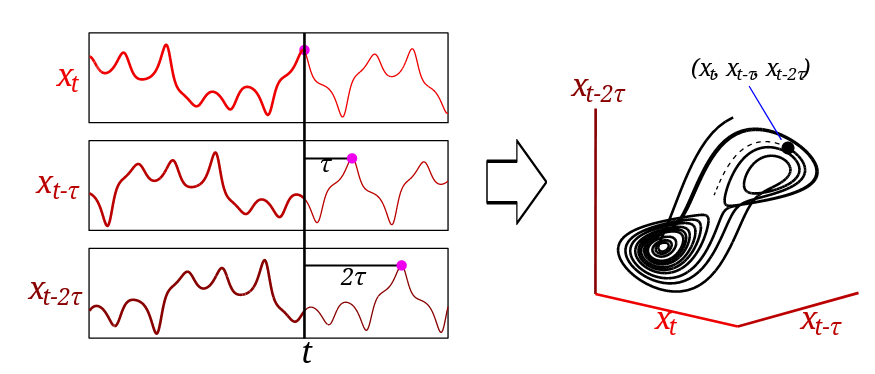
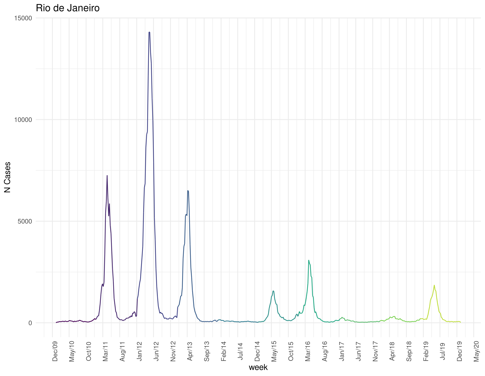
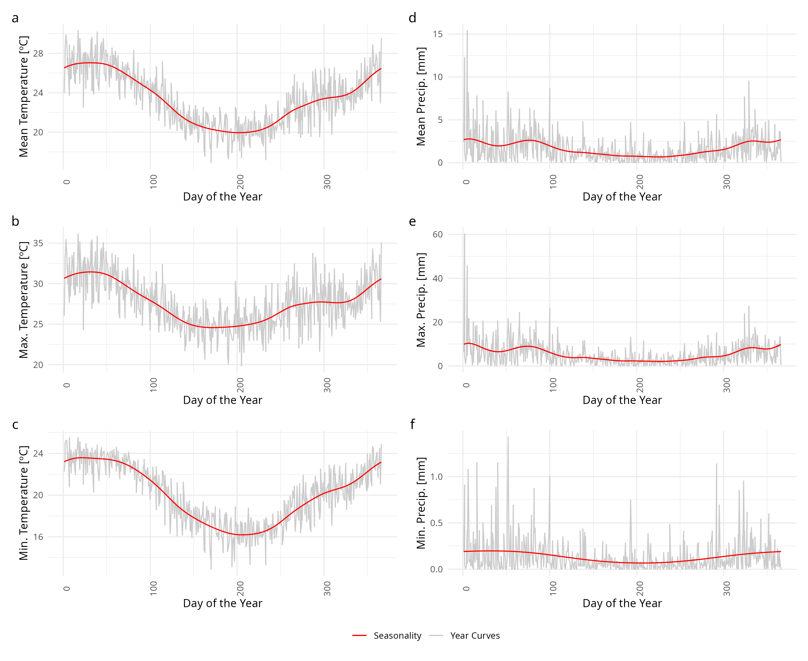
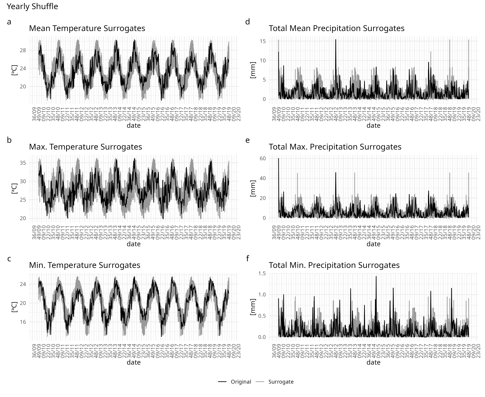
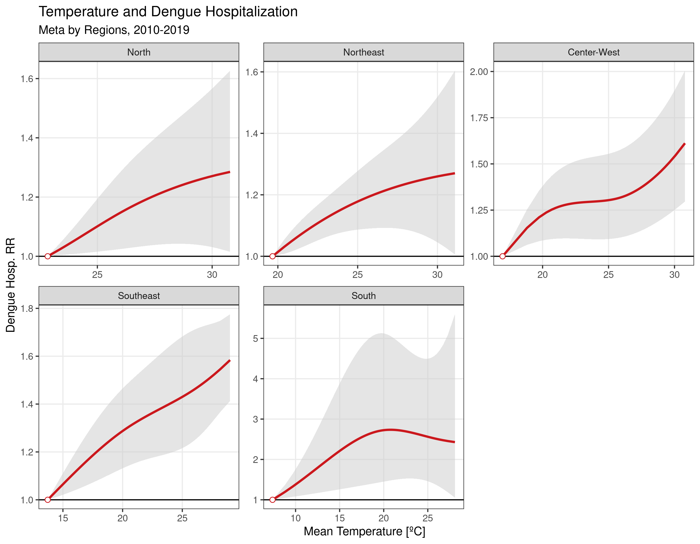

layout: true

```{r setup, include=FALSE}
options(htmltools.dir.version = FALSE)
knitr::opts_chunk$set(echo = FALSE)
```

```{r xaringan-themer, include = FALSE}
options(htmltools.dir.version = FALSE)
library(xaringanthemer)
library(xaringanExtra)
library(knitr)
library(DT)
library(RefManageR)
library(icons)
# duo_accent(
#   primary_color = "#A70000",
#   secondary_color = "#ff0000",
#   white_color = "white",
#   header_font_google = google_font("Roboto Condensed"),
#   text_font_google   = google_font("Roboto Condensed", "300", "300i"),
#   code_font_google   = google_font("Ubuntu Mono"), text_font_size = "30px")
# use_extra_styles(
#   hover_code_line = TRUE, 
#   mute_unhighlighted_code = TRUE)
xaringanthemer::style_mono_accent(
  base_color = "#A70000",
  #  primary_color = "#A70000",
  #secondary_color = "#ff0000",
  white_color = "white",
  colors = c(
    red = "#A70000",
    purple = "#88398a",
    orange = "#ff8811",
    green = "#136f63",
    blue = "#4B4FFF",
    white = "#FFFFFF",
    black = "#181818"
  ),
  header_font_google = google_font("Roboto Condensed"),
  text_font_google   = google_font("Roboto Condensed", "300", "300i"),
  code_font_google   = google_font("Ubuntu Mono"),
  text_font_size = "30px",
  code_font_size = "30px",
  )
xaringanExtra::use_share_again()
```

---

class: left

## Find me at

.left-column[

`r fontawesome::fa("github")` GitHub: [https://github.com/rafalopespx/](https://github.com/rafalopespx/)

`r fontawesome::fa("mail-bulk")` e-Mail: [lopes1313@gmail.com](mailto:lopes1313@gmail.com)

`r fontawesome::fa("twitter")` Twitter: [@rafalpx](www.twitter.com/rafalpx)

]

.pull-right[


]

---

## About me

+ Ph.D. Candidate in Physics at the Instituto de Física Teórica - IFT/ UNESP-SP

+ With a exchange period (2021-2022), in the Barcelona Institute for Global Health (ISGlobal), at Barcelona.

+ Master in Physics by IFT/UNES-SP (2018)

+ Bachelor in Physics by UNICAMP (2014)

---

## Summary

This presentation is divided into 4 main parts:

+ Historical background on dengue

+ Ecological analysis of dengue and climate data

+ Epidemiological analysis of dengue and temperature data

+ Final remarks

---

## Research questions

The thesis has two main underlying questions:

* In the Ecological part: **How temperature and precipitation affects the variability of dengue cases in a major city of Brazil?** The study covers 10 years (2010 - 2019) of dengue incidence

* In the Epidemiological part: **How temperature is associated with higher levels of dengue hospitalizations in Brazil?**
The study covers 10 years (2010 - 2019) of dengue hospitalization incidence

---

class: middle, center, inverse

# Historical background

---

## Historical background

Dengue has been a major problem in Brazil throughout the 20th Century:

- First records of dengue in Brazil starts on the last decades of the 19th century

- The main vector of dengue, _Aedes Aegypti_ got locally eliminated, but was reintroduced in the 1970s

- Since then, dengue has continuously risen in incidence and dispersion over the Brazillian territory

- Since 2001, a dedicated system of notification and surveillance to the disease was built

---

## Dengue disease

.pull-left[

Dengue has the following characteristic:

  - vector borne disease, human-mosquito-human cycle

  - incubation period of four- to six-day and persists until around the time fever abates, 
which is typically three to seven days, potential of cryptic transmissions

  - endemic disease in Brazil, with anual cycles of outbreaks

]

.pull-right[

```{r}
knitr::include_graphics("img/Aedes_aegypti.jpg")
```

]

---

## Data sources:


.pull-left[

__Epidemiological data sources__

  - _Sistema de Informação de Agravos de Notificação_ (__SINAN__), system more prompt to notify symptomatic mild cases of dengue

  - _Sistema de Informação Hospitalares_ (__SIH__), system more prompt to notify severe cases of dengue


]

.pull-right[

__Climate data sources__

  - For the climate variables, we used the gridded daily ECVs taken from reanalysis products (__ERA5-Land__) 

  - From the raw ECVs were produced weighted mean area aggregations over the municipalities (health regions, states, etc.) 
  extent area, to create matching time series for each aggregation level

]


---

## Characteristics of dataset

The SINAN-Dengue has:

  - ~11.0 million of individual cases confirmed for dengue, with information of Sex, Age, Municipality of Residence, from 2001 to 2020

  - Sparse data before 2000, due to non obligatory notification, more consistent data after 2001

  - With the majority of cases in the Southeast region and Northeast regions, ~5.7 millions and ~2.2 million cases, respectively

---

## Characteristics of dengue epidemics

The time-series of cases shows:

  - Strong seasonality, right after the rainy season, relation to mosquito life cycle

  - endemicity, endemic of annual outbreaks  of four different serotypes

  - More recently, since 2020, has been raising on incidence and spread to the South region

---

```{r endemicity, echo=FALSE, message=FALSE, warning=FALSE, out.width=750, fig.align='center'}
knitr::include_graphics("img/dengue_cases_regions_after_2001.png")
```

---

class: middle, center, inverse

# Ecological analysis

In collaboration with: Brenno Caetano Troca Cabella, Renato Mendes Coutinho, Roberto André Kraenkel

---

## Objectives and questions

**How temperature & total preciptation affects the counts of cases due to dengue in Rio de Janeiro, during 2010-2019?**

Objectives: 

  -1) To quantify climate drivers by *EDM* of temperature and precipitation on counts of cases due to dengue

  -2) Understand which are the climatic drivers and how much they force on cases

---

## Data sources

  - We compiled the SINAN-Dengue database filtered for the Rio de Janeiro city, during the period of 2010 to 2019, for the cases time series
  
  - For the climate variables, we used the gridded daily temperature taken from reanalysis products (ERA5Land) which were aggregated as weighted mean areas over the municipality extent area

---

## Empirical Dynamic Modelling

Framework to analyse time series seeking for causality between them:

  - From the Takens theorem we can reconstruct any dynamical system by any $X_1(t)$ and its delays $X_1(t-\tau), X_1(t-2\tau),\dots$

---

```{r takens theorem, echo=FALSE, message=FALSE, warning=FALSE, out.width=800, fig.align='center'}
knitr::include_graphics("img/Takens Theorem.png")
```

---

## Empirical Dynamic Modelling

Framework to analyse time series seeking for causality between them:

  - From the Takens theorem we can reconstruct any dynamical system by any observation and its delays

  - This reconstruction it is called __Shadow-Manifold__, it maps complete the dynamics into the original manifold

---

```{r state space, echo=FALSE, message=FALSE, warning=FALSE, out.width=800, fig.align='center'}

```

---

## Empirical Dynamic Modelling

Framework to analyse time series seeking for causality between them:

  - From the Takens theorem we can reconstruct any dynamical system by any observation and its delays

  - This reconstruction it is called __Shadow-Manifold__, it maps complete the dynamics into the original manifold

  - Any two __Shadow-Manifolds__ that maps each other are __causal__ linked

---

```{r causality, echo=FALSE, message=FALSE, warning=FALSE, out.width=800, fig.align='center'}

```

---

## Convergent Cross-Mapping (CCM)

EDM in practice is to give predictions, $\hat{Y}$, of points on one __Shadow-manifold__, $\mathbf{M}_Y$, given the dynamics of point with the same time indexes, onto other manifold, $\mathbf{M}_X$, in a equation:

$$
\begin{equation}
\hat{Y}(t)|\mathbf{M_X} = \sum_{i=1}^{E+1}w_iY_i(t)
\end{equation}
$$
Repeating this mapping for the complete set of points of each time series, we can have a prediction of $\hat{Y}$ given the points of $X$, and vice-versa.

---

## Causality criteria

With the last equation, we gave a prediction, $\hat{Y}$, for $Y$, given the points in $\mathbf{M}_X$, the comparison between the observed time series of $Y(t)$ and the predicted time series $\hat{Y}(t)$, is the measure of how strong linked each __Shadow-Manifold__ is to the other:

$$
\begin{equation}
\rho_{CCM} = \frac{Cov[O, P]}{\sigma_O \sigma_P}
\end{equation}
$$

If this correlation converges to a value, as we take more and more points, this is the criteria for the causality and linking between the both __Shadow-Manifolds__, here $\mathbf{M}_X$ and $\mathbf{M}_Y$

---

## Time for prediction

Another part of the EDM framework is to know how much lagged a climate driver that forces into the cases, to do so we test different time for prediction, $tp$, on the CCM equation, rewriting it, we have:

$$
\begin{equation}
\hat{Y}(t+tp)|\mathbf{M_X} = \sum_{i=1}^{E+1}w_iY_i(t)
\end{equation}
$$

Where $tp$ is how much ahead of the contemporaneous time we are trying to predict, or how much the relation is lagged, after testing different numbers of $tp$, we end up with a distribution of $\rho_{CCM}$ for different lags

---

## EDM procedure

We apply The typical procedure of *EDM* on the time series of cases of Rio de Janeiro:

  1) Extract the seasonality of the climate variables, make a distribution of surrogate time series.

  2) Do the CCM with the original time-series and 500 surrogates series with the same seasonality pattern

  3) Repeat 2) for different values of time for predicition $tp$

  4) The $tp$ with the original time series is above the 0.95th percentile of the $\rho_{CCM}$ distribution, it is a significant causal relation or a __driver__

  5) With the __drivers__ found, estimate the force of interaction between dengue cases and climate variable, by applying S-Map

---

class: middle, center

# Application

---

```{r rj-plot, echo=FALSE, message=FALSE, warning=FALSE, out.width=800, fig.align='center'}

```

---

## Extracting seasonality & surrogate making

The algorithm we use is:

  - Fit a cubic smooth spline to each climate variable, this gives a seasonal component to the time series

  - Substract the seasonality pattern from the original climate time series

  - The residuals are shuffled yearly and added to the seasonality pattern

  - This new surrogate time series for the climate variable, has the same seasonal pattern but different residuals

  - Repeat this 500 times for each climate variable

---

```{r rj-precip-season, echo=FALSE, message=FALSE, warning=FALSE, out.width=700, fig.align='center'}

```

---

## Surrogate statistical test, I

With 500 surrogates time series for each climate variable we can create a statistical test, by putting this on the CCM function, we ask if the seasonal pattern is driving the dynamics 
    
  - if yes, the surrogates will have a better prediction skill, $\rho_{CCM}$, than the original time series
    
  - if not, the surrogates will have a worst prediction skill, $\rho_{CCM}$, than the original time series

---

```{r, echo=FALSE, message=FALSE, warning=FALSE, out.width=700, fig.align='center'}

```

---

## Surrogate statistical test, II

Now we want to find where in the time for prediction, $tp$, the original climate time series is the most significant __driver__:

  - We apply CCM on the 500 surrogates and the original time series for various $tp$ values, of maximum 17 weeks of delay

  - Where the original driver time series is above the 95th percentile of the distribution it causally significant

---

```{r rj-boxplot-tps, echo=FALSE, message=FALSE, warning=FALSE, out.width=700, fig.align='center'}

```

---

## Surrogate statistical test, III

For the causality criteria and the lagged relation the algorithm is:

  - Where the original time series has a value of $\rho_{CCM}$ higher than the 95th percentile of the distribution, we color it in red

  - We repeat this procedure of identifiying where the original climate time serie is stastistically significant through over all the $tp$ values tested
  
---

```{r rj-boxplot-sig, echo=FALSE, message=FALSE, warning=FALSE, out.width=700, fig.align='center'}

```

---

## Force of Interaction

With the climate __driver__ and the time for prediction, $tp$ where the original time serie is causal significant and where it is has the greater $\rho$, we estimate the force of interaction:

  - Using the S-Map algorithm, we estimate the effect of the __driver__, at the $tp$ with maximum $\rho_{CCM}$, on the time series of cases

  - S-Map is a non-parametric method to estimate the locally weighted Jacobian Element to predicts of the cases time-series from the climate drivers with a SSR built with the cases time series, and the cliamte __drivers__

---

## Force of Interaction

The S-Map has the following formula, which it is a Singular Value Decomposition (SVD) algorithm:

$$
\begin{equation}
Cases(t) = \mathbf{C_0} + \sum_{i=1}^{I} \mathbf{C_i}(t) x_i(t),
\end{equation}
$$

Where $I$ is until the __drivers__ we found as significantly causal on the cases time series. We choose the minimum value of Mean Absolute Error (MAE), between predictions and observations given by the S-Map for $\theta$. Where $C_i$ are weights to pounder how great are the influences of each nearby point on the predicted point.

---

## Theta form

$\theta$ it is the locally weighted kernel to the decay of influence of each point considered into the prediction, with the formula: 

$$C_i = \exp^{-\theta\frac{\|x(t_k) - x(t)\|}{d}}$$

If $\theta$ is $0$ or close to $0$ the model understand the influence of each driver as linear, as $\theta$ grows the model gives more non-linearity weight to each of the drivers.

---

```{r theta, echo=FALSE, message=FALSE, warning=FALSE, out.width=700, fig.align='center'}
knitr::include_graphics('img/yearly_shuffle_tp_17_theta_min_mae_rmse.png')
```

---

## S-Map Models

We then employ the following model to the force of interaction estimation:

$$
\begin{multline}
Cases(t) = \mathbf{C_0} + \frac{\partial Cases(t)}{\partial Precip_{max}(t-2)}Precip_{max}(t-2)+ \\
\frac{\partial Cases(t)}{\partial Precip_{min}(t-7)}Precip_{min}(t-7)
\end{multline}
$$

Where $C_0$ is a constant term and the following terms are the coeffcients to be estimated locally over the SSR constructed with the time-series $Cases(t),Precip_{min}(t-7), Precip_{max}(t-2)$

---

```{r foi, echo=FALSE, message=FALSE, warning=FALSE, out.width=750, fig.align='center'}

```

---

## Conclusion & Interpretation

  * __Precipitations__ drives the cases by variability at the right conditions, this result matches with an application of EDM on dengue time series in Puerto Rico

  * __Maximum Precipitation__ has an lagged effect on cases of 2 weeks, and it decreases with the rising of maximum amount precipitation
    * we understand it as being a driver that has a saturation effect on the forcing, flushing effects on mosquito life cycle.

  * __Minimum Precipation__ has a lagged effect on cases of 7 week, in the same shape as Max. 
    * after drought any amount of precipitation helps the mosquito cycle. 
  
  * __Temperatures__ are climate drivers of cases at Rio de Janeiro city, but drives cases in the city by its seasonality and not by its variability.

---

class: middle, center, inverse

# Epidemiological analysis

In collaboration with: Xavier Basagaña, Leonardo S. L. Bastos, Fernando A. Bozza, Otavio T. Ranzani

---

## Objectives and questions

**How ambient temperature affects the counts of hospitalization due to dengue, during the period of 2010-2019?**

Objectives: 

  - To quantify association of daily ambient temperature and counts of hospitalization due to dengue

---

## Data sources:

  - We used the Brazil national database of authorization for hospitalization (AIH), filtered for the ICD-10 codes, ’A90’, ’A91’, ’A97’, ’A970’, ’A971’, ’A972’, ’A979’, for the hospitalization cases of dengue, aggregated by municipality.

  - For the climate variables, we used the gridded daily temperature taken from reanalysis products (ERA5Land) which were aggregated as weighted mean areas over the municipality extent area, to create matching time series for each municipality.

---

## Study Design

We did a two-stages design, to the association of the daily mean temperature and counts of hospitalization due dengue.

  + First stage: A "Time Stratified" design for the aggregated level of a each of 27 states, with a stratum for each municipality within a state, day of the week and the month on the time series

  + Second stage: Multivariate Meta-analysis for the coefficients fitted and the Covariance matrix, in two levels of aggregation, for the whole country and for the 5 macro regions of Brazil

  - The model on this level was a multivariate random effects model ran by a restricted maximum likelihood estimator

---

## Model specification, first stage

We suppose the dengue hospitalization counts in a city $i$ at time $t$ is given by a $Poisson(\lambda_{i,t})$ distribution, with the conditional that $Y_{.,t} = \sum_i Y_{i,t}$:

$$
\begin{equation}
Y_{i,t} \sim Poisson^*(\lambda_{i,t},\psi)
\end{equation}
$$

Where the $\lambda_{i,t}$ is the mean of $Poisson$ distribution and $\psi$ is the parameter to control overdispersion, and we choose a log function for the link-function

---

## Model specification, first stage

On each of 27 states, we run a Conditional Poisson model, for the association between dengue hospitalizations time series and mean temperature for each municipality:

$$log[\lambda_{i,t}] = \xi_{t,i} + f(x_{t,i},l) + \sum_{k=1}^{K}s_k(t)$$

Where $\lambda_{t,i}$ is as before the mean of count of cases at $t$ on the i-th municipality, $\xi_{t,i}$ the dow-month-city strata term conditioned out. $f(x_{t,i}, l)$ which is the __DLNM__ for mean temperature on the state by each day of delay, until 21 days of lags. The last term is the long-term trend for temperature trend along the whole period, a natural spline with 7 degrees of freedom by year on the whole period.

---

## Crossbasis Parametrization

The *cross-basis* were parametrized as the standard in __DLNM__ for mean temperature: 

  + A *natural splines* with 2 knots equally spaced on the range of mean temperature,
for the structure to the doses-response

  + A *natural spline* with 3 knots equally spaced on the log-scale for the lag-response structure

  + 0 to the date of hospitalization until 21 days of lags, before the date of hospitalization

---

## Geographical Variation

Why we make use of such models? Because enviromental exposures has two main features that needs atention to be drawned:

  + Normally, exposures varies in a narrow range, environmental exposures like temperature __not__, it varies along different locations

  + Normally, exposures have a very short time-window of action, environment exposures __not__, it can acts all the time for the all the subjects

---

```{r geo, echo=FALSE, message=FALSE, warning=FALSE, out.width=800, fig.align='center'}
knitr::include_graphics("img/geo_temp_inset.png")
```

---

## Second Stage

For the second stage we choose a multivariate meta-analysis model, on each meta-analysis level, whole country or by macro region, with the following formulation:

$$
\begin{equation}
\hat{\theta_i} | u_i \sim N_k (\theta + u_i , S_i ), \\
u_i ∼ N_k (0, \psi)
\end{equation}
$$

Where $\hat{\theta_i}$ is a vector of $k\times1$ combined effects to the estimate, $u_i$ is a vector of $k \times 1$ random effects for the coefficients of study $i$. $S_i$ matrix $k \times k$ covariance matrix within studies for the study $i$ and $\psi$ matrix $k \times k$ covariance between studies, defined by $k(k + 1)/2$ variables $\xi$.

---

class: middle, center

# Second Stage Results, Whole Country Meta-analysis

---

```{r brasil-overal-absolute, echo=FALSE, message=FALSE, warning=FALSE, out.width=800, fig.align='center'}
knitr::include_graphics("img/figure_1_meta_analysis.png")
```

---

class: middle, center

# Second Stage Results, Regions Meta-analysis

---

```{r regions-overall-absolute, echo=FALSE, message=FALSE, warning=FALSE, out.width=800, fig.align='center'}

```

---

## Table Summary

```{r table-summary, echo=FALSE, message=FALSE, warning=FALSE, out.width=800}
table<-vroom::vroom(file = "../Xaringan_defense/Tables/table_1_mht_RR_absolute.csv")
table<-table %>% 
  setNames(c("State", "MHT", "RR 5th (IC 95%)", "RR 95th (IC 95%)"))
rmarkdown::paged_table(table)
```

---

## Conclusion & Interpretation

  * The main finding is that there is a higher risk of being hospitalised by dengue as the temperature gets higher.
  
  * After 20 degrees Celsius, the relative risk is 1·2x higher than for the minimum temperature of hospitalisation (10·8 º C)
  
  * We found a stronger immediate effect on the RR to the hospitalisation, with a slight lagged effect
  
  * We found the same patterns over each macro region of Brazil for the general association between RR hospitalisation and ambient temperature. 

---

class: middle, center, inverse

# Final Remarks and Next steps


---

## Summary, Ecological part

On this part we had studied the dynamics of mild to severe cases of dengue in Brazil, during the a period of 10 years, from 2010 to 2019.

  - we investigated how temperature and precipitation drives the dynamics of cases in a major city that has a historical of endemicity od dengue, for the cited period.

  * Main finding is that __precipitation is a driver of the dynamics of cases__ through the variability of the time-series, and it has a lagged relation for this forcing, being 2 weeks lagged for the maximum precipitation and 7 weeks for the minimum precipitation

  * Secondary finding, is that temperature has a role on the dynamics of dengue cases through seasonality

---


## Summary, Epidemiological part

On this part we had studied the dynamics of severe hospitalized cases of dengue in Brazil, during the a period of 10 years, from 2010 to 2019.

  - we investigated how temperature is associated with dengue hospitalizations in the whole country at the level of municipality, and how this can give an augmented risk to hospitalizations.

  * Main finding is that __temperature above 20 degrees Celsius is consistently associated with higher levels of hospistalisations__, over the whole country and the for each of the macro-regions.

  * Secondary finding, is that temperature has lagged effects when producing augmented risks to the hospistalisations.

---

## Summary

On this thesis, we investigated the relation of two climate variables with dengue disease, over Brazil during the a 10 years period, from 2010 to 2019

  - This thesis contribute to the general knowledge of the relations between climatic factors and dengue disease and can be viewed as a contribution to disease-ecology.
  
  - Although extrapolation of results obtained in one region to other regions should be considered with caution, the results presented can shed some light on the possible consequences of climate change on the range and consequences of dengue epidemics

  - This thesis does not permit the establishment of a more mechanistic interpretation, as no data about mosquito abundance is used on this thesis

---

class: middle, center

# Other publications

---

## Published Articles

  * **Model-based estimation of transmissibility and reinfection of SARS-CoV-2 P. 1 variant**,
  Coutinho, R.M., Marquitti, F.M.D., Ferreira, L.S., Borges, M.E., __da Silva, R.L.P.__, Canton, O., Portella, T.P., Poloni, S., Franco, C., Plucinski, M.M. and Lessa, F.C., 2021.
  [https://www.nature.com/articles/s43856-021-00048-6](https://www.nature.com/articles/s43856-021-00048-6) 
  Communications Medicine, 1(1), pp.1-8.

  * **Brazil in the face of new SARS-CoV-2 variants: emergencies and challenges in public health**, 
  Marquitti, F.M.D., Coutinho, R.M., Ferreira, L.S., Borges, M.E., Portella, T.P., __Silva, R.L.P.__, Canton, O., Poloni, S., Franco, C., Coelho, V. and Barberia, L., 2021.
  [https://www.scielo.br/j/rbepid/a/fMnYkyJKLhpwj8fF8dkbgKQ/?lang=en](https://www.scielo.br/j/rbepid/a/fMnYkyJKLhpwj8fF8dkbgKQ/?lang=en) 
  Revista Brasileira de Epidemiologia, 24.
  
---

## Published Articles

  * **Assessing the best time interval between doses in a two-dose vaccination regimen to reduce the number of deaths in an ongoing epidemic of SARS-CoV-2**,
  Souto Ferreira, L., Canton, O., __da Silva, R.L.P.__, Poloni, S., Sudbrack, V., Borges, M.E., Franco, C., Marquitti, F.M.D., de Moraes, J.C., Veras, M.A.D.S.M. and Kraenkel, R.A., 2022.
  [https://journals.plos.org/ploscompbiol/article?id=10.1371/journal.pcbi.1009978](https://journals.plos.org/ploscompbiol/article?id=10.1371/journal.pcbi.1009978)
  PLoS computational biology, 18(3), p.e1009978.

---

## Submitted Articles

  * **Ambient Temperature and dengue Hospitalisation in Brazil over a 10-year period, 2010-2019: a times series analysis**,
  __da Silva, R.L.P__, Basagana, X., Bastos, L.S., Bozza, F.A. and Ranzani, O.T., 2022.
  [https://www.medrxiv.org/content/medrxiv/early/2022/04/15/2022.04.05.22273394.full.pdf](https://www.medrxiv.org/content/medrxiv/early/2022/04/15/2022.04.05.22273394.full.pdf)
  medRxiv. (Under Review in The Lancet Regional Americas)

  * **Estimating the impact of implementation and timing of COVID-19 vaccination program in Brazil: a counterfactual analysis**,
  Ferreira, L.S., Marquitti, F.M.D., __da Silva, R.L.P__, Borges, M.E., Gomes, M.F., Cruz, O.G., Kraenkel, R.A., Coutinho, R.M., Prado, P.I. and Bastos, L.S., 2021. 
  [https://www.medrxiv.org/content/medrxiv/early/2021/12/27/2021.12.24.21268384.full.pdf](https://www.medrxiv.org/content/medrxiv/early/2021/12/27/2021.12.24.21268384.full.pdf)
   medRxiv. (Accepted in the The Lancet Regional Americas)

---

## Software published

.pull-left[

During the covid-19 pandemic, together with **Leaonardo Bastos**, we build a wrapping R package **Nowcaster** to produce at necessity age-dependent nowcastings, to correct the notification delay of cases, the package website is: [https://www.covid19br.github.io/nowcaster](https://www.covid19br.githubu.io/nowcaster)

]

.pull-right[

# <a href='https://github.com/covid19br/nowcaster'></a> <a href='https://github.com/covid19br/nowcaster'></a>

]

---

## Acknowledgements

.pull-left[

- To my financing agencies for the financial support, CNPq, for the Ph.D. fellowship and CAPES for the exchange period abroad fellowship

- To the IFT for the material support and program support, to the ISGlobal for the exchange period

]

.pull-right[

# <a href='https://www.gov.br/capes/pt-br'></a> <a href='https://www.gov.br/cnpq/pt-br'></a>

# <a href='https://www.ift.unesp.br'></a> <a href='https://www.isglobal.org'></a>
]

---

class: middle, center

# Thank You!
# ¡Gracias!
# Obrigado!

`r fontawesome::fa("github")` GitHub: [https://github.com/rafalopespx/](https://github.com/rafalopespx/)
`r fontawesome::fa("mail-bulk")`  [lopes1313@gmail.com](mailto:lopes1313@gmail.com)
`r fontawesome::fa("twitter")` Twitter: [@rafalpx](www.twitter.com/rafalpx)

---

class: middle, center, inverse

# Appendices

---

class: middle, center

# Empirical Dynamical Modelling

---

## Takens Theorem

The importance of Takens theorem, in view of applications, is that we can reconstruct an
attractor solely from one of its variables time-series. It means that we can use $X_1$ to obtain the attractor of the system that generated the time-series $X_1$, without any knowledge of the underlying equations. The reconstruction is built considering an m-dimensional space with time-lagged coordinates:

$$\{X_1 (t), X_1 (t + \tau ), X_1 (t + 2\tau ), ...X_1 (t + (m − 1)\tau \}$$

By considering the time-series $X_1 (t)$ for all t, we will have a sub-manifold of the m-dimensional space. This sub-manifold has a one-to-one correspondence with the original attractor of the system. Takens theorem
guarantees that the dimension m is, at most, $2n + 1$.

---

## Simplex Projection, I

The simplex projection is basically a method
to follow $n$ time steps ahead each of the simplex points encapsulating a single point, the
predictee point, $\hat{X}(t+n)$.

$$
\begin{equation}
\hat{X}(t+n) = \sum_{i=1}^{E+1}w_iX_i(t+n)
\end{equation}
$$
When varying how many delays we put into the embedding dimension of reconstructed state-space, we can choose the optimal embedding
dimension for the system.

---

## Simplex Projection, II

After realising this projection for the whole time series, i.e., using all the points we compare the observed time series and the predictied one, from this we can given an good estimate on how good is the projection we are building:

$$
\begin{equation}
\rho_{O,P} = \frac{Cov[O,P]}{\sigma_O \sigma_P}
\end{equation}
$$

The embedding dimensions will be the dimension for which this correlation reaches its maximum, this means the dimension is sufficient to reconstruct completely the original dynamics

---

```{r, echo=FALSE, message=FALSE, warning=FALSE, out.width=800, fig.align='center'}

```

---

## Causality criteria

With the last equation, we gave a prediction, $\hat{Y}$, for $Y$, given the points in $\mathbf{M}_X$, the comparison between the observed time series of $Y(t)$ and the predicted time series $\hat{Y}(t)$, is the measure of how strong linked each __Shadow-Manifold__ is to the other:

$$
\begin{equation}
\rho_{CCM} = \frac{Cov[O, P]}{\sigma_O \sigma_P} = \frac{Cov[Y,\hat{Y}|\mathbf{M_X}]}{\sigma_Y\sigma_{\hat{Y}|\mathbf{M_X}}}
\end{equation}
$$

If this correlation converges to a value, as we take more and more points, this is the criteria for the causality and linking between the both __Shadow-Manifolds__, here $\mathbf{M}_X$ and $\mathbf{M}_Y$

---

class: middle, center

# Distributed Lag Non-linear Model

---

## Model building, First stage

In this study we suppose the dengue hospitalization counts in the city $i$ at time $t$ is given by a $Poisson(\lambda_{i,t})$ distribution, with the conditional that $Y_{.,t} = \sum_i Y_{i,t}$, this actually is a $Multinomial$ model, which we use an alternative formulation of an $quasiPoisson$ distribution to account for overdispersed data:

$$
\begin{equation}
Y_{i,t}|Y_{.,i} \sim Multinomial(\pi_{i,t}) \equiv quasiPoisson(\lambda_{i,t},\psi)
\end{equation}
$$

Where $\pi_{i,t}$ is given by the relation $\pi_{i,t} = \frac{\exp(\boldsymbol{\beta^T\boldsymbol{x_i}})}{\sum_{j\in t}\exp{\boldsymbol{\beta^{T}\boldsymbol{x_j}}}}$ and equivalently for the $\lambda_{i,t}$, and we choose a log link-function

---

## Cross-basis, I

Cross-basis is an advance on the enviromental epidemiology, cause it permits to construct a non-linear covariate that encompasses delays when studiying associationn between environmental factors and epidemiological outocomes of interest. To do so, we start construct a naive model, the Distributed Linear Model, __DLM__. A first __DLM__ is:

$$
\begin{equation}
\log[E[Y_t]] = \alpha + \beta_0x_t + \beta_1x_{t-1} + \dots + \beta_jx_{t-j} + Covariates \dotsc, 
\end{equation}
$$
This model has the pathologically case of introducing vartiables that will produce over and underestimates to the association, but it was a first attempt to model dealyed relation in epidemiology.

---

## Cross-basis, II

A way to overcome this is by using splines to smooth this covariates introduced: 

$$
\begin{equation}
log(\mu_t) = \alpha + \sum_{j=1}^{J}s_j(x_{tj}; \boldsymbol{\beta}_j) + Covariates
\end{equation}
$$

Where $s_j(x_{tj}; \boldsymbol{\beta}_j)$ is the smoothing function, which can be reshaped to be turned into a more flexible form that can encompasses non-linear forms to the model.


---

## Cross-basis, III

The way to do this is by producing a _Basis-function_ that will expand eahc of the dimension, lag-response and dose-response into a smoothed version. This guarantees no over and/or understimation during the model processing.

$$
\begin{equation}
log(\mu_t) = \alpha + \sum_{j=1}^{J}\mathbf{w}_{t,j}^T\boldsymbol{\eta} + Covariates
\end{equation}
$$

Where $s(x_t;\boldsymbol{\eta}) = \mathbf{q}_t^T \cdot \mathbf{C} \boldsymbol{\eta} = \mathbf{w}_t^T\boldsymbol{\eta}$, is the _basis-function_ expanding the covariate into a its lags with a smoothing form for it.

---

## Cross-basis, IV

To construct a flexible and non-linear version of _DLM_ basically is to expand the $s(x_t; \boldsymbol{\eta})$, at same time on the dimension of lags and dose, this will produce the a covariate that can be seen as a surface:

$$
\begin{equation}
s(x_t ; \boldsymbol{\eta}) = \sum_{j=1}^{v_x}\sum_{k=1}^{v_l}\mathbf{r}^T_{t j} \mathbf{c}_{k } \eta_{jk} = \mathbf{w}^T_{t} \boldsymbol{\eta}
\end{equation}
$$

Where the $s(x_t; \boldsymbol{\eta})$ is called __cross-basis__, this is a resulta of a Haddamard product of two Kroenecker products, given by: $\mathbf{A}_{t} = (\mathbf{1}_{v_l}^T \otimes \mathbf{R}_t) \odot (\mathbf{C} \otimes \mathbf{1}_{v_x}^T),$

---

## Model building, Second stage

As before, in the second stage we build a meta-analysis multivariate model to estimate, by different aggergations setting, the overall RR for dengue hospitalization. To do so, we start imposing that for each $\hat{\theta_{i}}$ study estimates we model its variance and covariance relation, with:

$$
\begin{equation}
\hat{\theta_i} | u_i \sim N_k (\theta + u_i, S_i ), \\
u_i ∼ N_k (0, \psi)
\end{equation}
$$

Where, $\hat{\theta_i}$ vector $k\times1$ combined effects to the estimate, 
$u_i$ vector $k \times 1$ random effects for the coefficients of study $i$.
$S_i$ matrix $k \times k$ covariance matrix within studies for the study $i$ and $\psi$ matrix $k \times k$ covariance between studies, defined by $k(k + 1)/2$ variables $\xi$.

---

```{r, echo=FALSE, message=FALSE, warning=FALSE, out.width=800}

```

