layout: true

```{r setup, include=FALSE}
options(htmltools.dir.version = FALSE)
knitr::opts_chunk$set(echo = FALSE)
```

```{r xaringan-themer, include = FALSE}
options(htmltools.dir.version = FALSE)
library(xaringanthemer)
library(xaringanExtra)
library(knitr)
library(DT)
library(RefManageR)
library(icons)
duo_accent(
  primary_color = "#A70000",
  secondary_color = "#ff0000",
  white_color = "white",
  header_font_google = google_font("Roboto Condensed"),
  text_font_google   = google_font("Roboto Condensed", "300", "300i"),
  code_font_google   = google_font("Ubuntu Mono"), text_font_size = "30px")
use_extra_styles(
  hover_code_line = TRUE, 
  mute_unhighlighted_code = TRUE)
```

---

class: left

## Find me at

.left-column[

`r fontawesome::fa("github")` GitHub: [https://github.com/rafalopespx/](https://github.com/rafalopespx/)

`r fontawesome::fa("mail-bulk")` e-Mail: [lopes1313@gmail.com](mailto:lopes1313@gmail.com)

`r fontawesome::fa("twitter")` Twitter: [@rafalpx](www.twitter.com/rafalpx)

]

.pull-right[


]

---

## About me

+ Ph.D. Student in Physics, in the Instituto de Física Teóric - IFT/ UNESP-SP

+ I am in the last year of my Ph.D. and planning on defending on end of Abril/beginning of May, 22.

+ With a exchange period, in the Barcelona Institute for Global Health, at Barcelona.

---

## Objectives and Questions

**How Temperatures & Total Preciptations affects the counts of Cases due to Dengue in Brazil, during 2010-2019?**

Objectives: 

-1) To quantify causality by *EDM* of t2m and precip and counts of cases due to Dengue

-2) Understand which are the climatic drivers and how much they force on cases

---

## Dengue Disease

-1) vector borne disease, human-mosquito-human cycle

-2) incubation period of four- to six-day and persists until around the time fever abates, which is typically three to seven days, potential of cryptic transmissions

-3) Hyperendemic disease in Brazil, with anual cycles of outbreaks

---

## Data sources and definitions:

- We have the Brazil national database of information system of severe notifications (SINAN), filtered for the cases of Dengue, aggregated by municipality, health regions, states, and/or any aggregation that is more suitable to the amount of cases.

- For the climate variable, we used the gridded daily ECVs taken from reanalysis products (ERA5Land) 

- We did a weighted mean area aggregation over the municipality (health regions, states, etc.) extent area, to create matching time series for each aggregation level.

---

## Characteristics of Dataset

- ~+ 20.9 million of individual cases, with information of Sex, Age, Municipality of Residence, fromm 2000 to 2020

- ~+ 12 millions of individual cases, from 2010, less cases on 2016 to 2018, Zika outbreak

- Sparse data before 2000, due to non obligatory notification

---

```{r before 2000, echo=FALSE, message=FALSE, warning=FALSE, out.width=800, fig.align='center'}
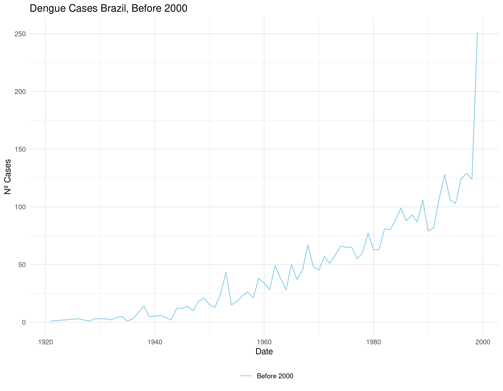
```

---


```{r after 2000, echo=FALSE, message=FALSE, warning=FALSE, out.width=800, fig.align='center'}
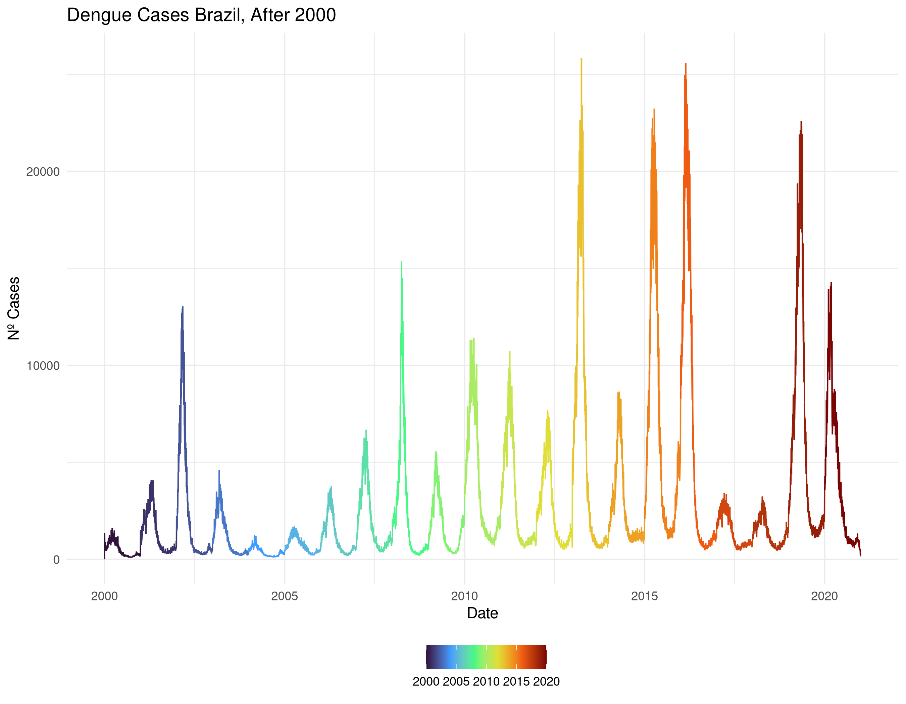
```

---

## Characteristics of Dengue epidemics

- Strong seasonality, right after the rainy season, relation with mosquito life cycle

- Hyperendemicity, huge peaks very narrow

- Before Covid-19 was the major public health problem in Brazil, has a low attack rate

---

```{r attackrate, echo=FALSE, message=FALSE, warning=FALSE, out.width=800, fig.align='center'}
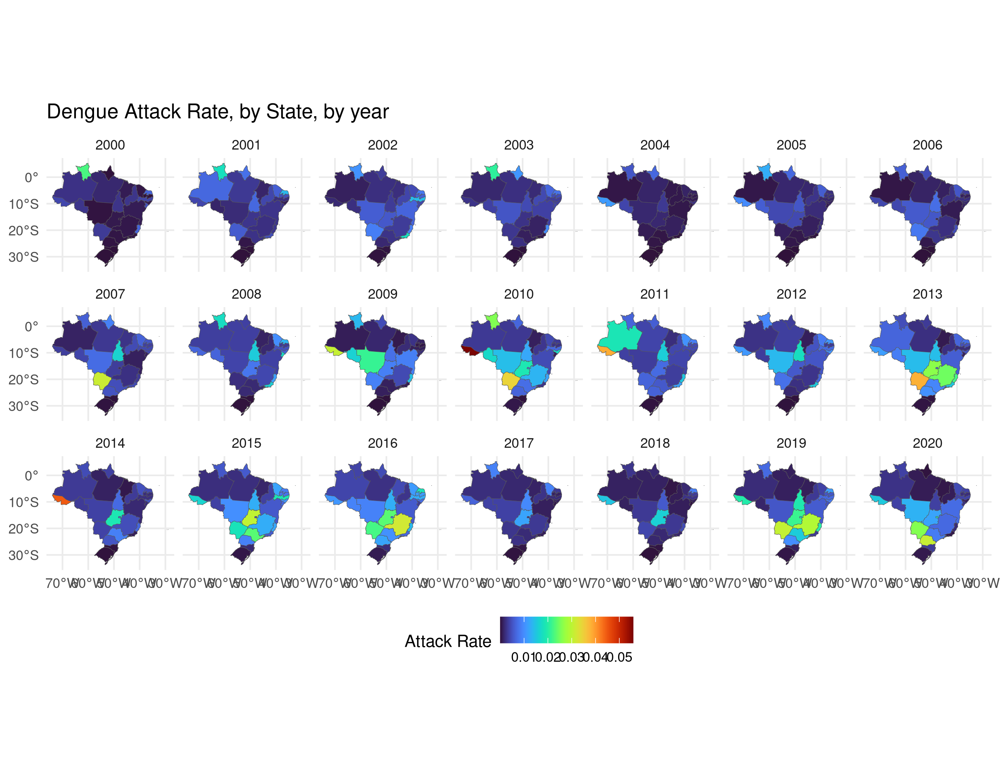
```

---

## Empirical Dynamic Modelling

Framework to analyse time series seeking for causality between them:

- From the Takens Theorem we can reconstruct any dynamical system by any observation and its delays

---

```{r takens theorem, echo=FALSE, message=FALSE, warning=FALSE, out.width=800, fig.align='center'}
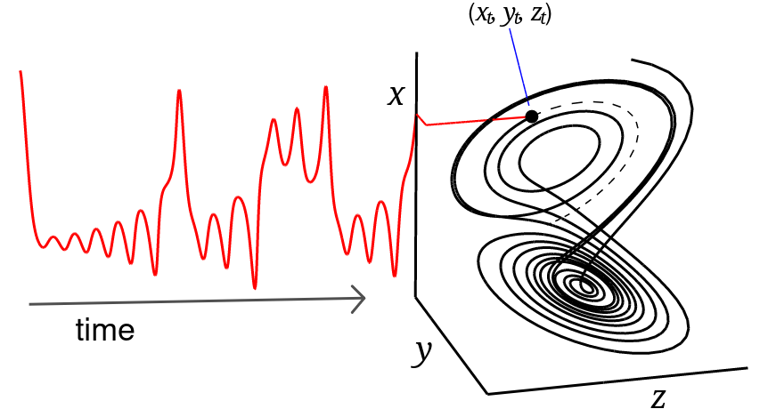
```

---

## Empirical Dynamic Modelling

Framework to analyse time series seeking for causality between them:

- From the Takens Theorem we can reconstruct any dynamical system by any observation and its delays

- This reconstruction it is called __Shadow-Manifold__, it maps complete the dynamics into the original Manifold

---

```{r state space, echo=FALSE, message=FALSE, warning=FALSE, out.width=800, fig.align='center'}
knitr::include_graphics("img/State Space Reconstruction.png")
```

---

## Empirical Dynamic Modelling

Framework to analyse time series seeking for causality between them:

- From the Takens Theorem we can reconstruct any dynamical system by any observation and its delays

- This reconstruction it is called __Shadow-Manifold__, it maps complete the dynamics into the original Manifold

- Any two __Shadow-Manifolds__ that maps each other are __Causal__ linked

---

```{r causality, echo=FALSE, message=FALSE, warning=FALSE, out.width=800, fig.align='center'}
knitr::include_graphics("img/Causality.png")
```

---

## Rio de Janeiro

- Pipeline implemented like as in the Laneri et al.

- 1) Extract the seasonality of the drivers, make a distribution of surrogate time series.

  2) Do the CCM with the Original time-series and 500 Surrogates series with the same seasonality pattern
  
  3) Repeat for different values of time for predicition $tp$

  4) Where in the $tp$ the Original is above the 0.95th percentile of the $\rho_{CCM}$ distribution for the 500 Surrogates time-series, it is significant causal relation

  5) Estimate the force of causality for the drivers at the time for prediction with highest $\rho_{CCM}$ by applying S-Map

---

```{r rj-plot, echo=FALSE, message=FALSE, warning=FALSE, out.width=800, fig.align='center'}
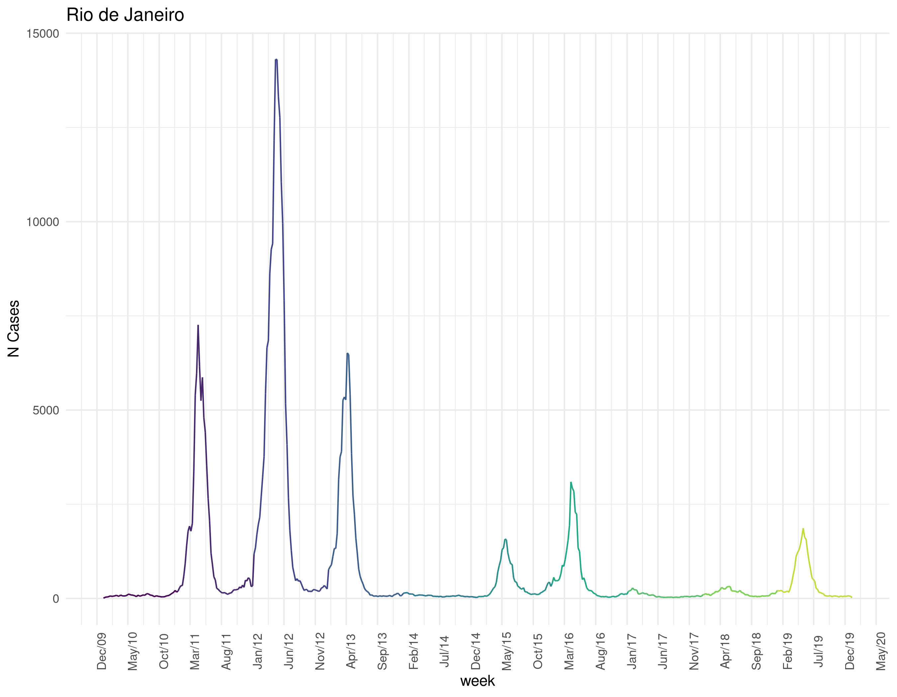
```

---

## Extracting seasonality & Surrogate making

The algorithm we use is:

 - Fit a cubic smooth spline to each climate driver, this gives a seasonal component to each driver
 
 - substract this seasonality pattern from the original driver time series
 
 - The residuals are shuffled and on this is added the seasonality pattern
 
 - This new surrogate time series for the climate driver, has the same seasonal pattern but different residuals
 
 - Make 500 of this surrogates series

---

```{r rj-temp-season, echo=FALSE, message=FALSE, warning=FALSE, out.width=800, fig.align='center'}
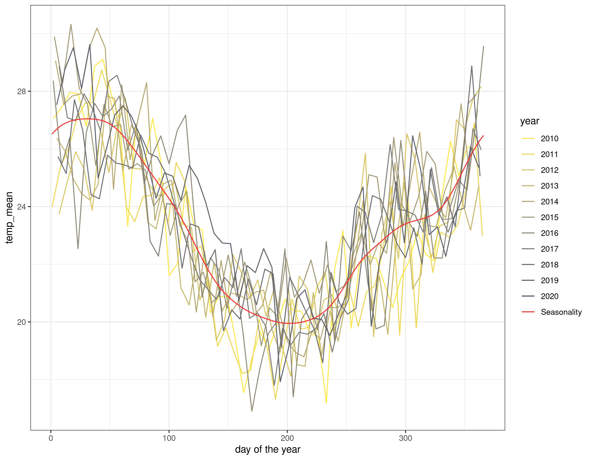
```

---

```{r rj-precip-season, echo=FALSE, message=FALSE, warning=FALSE, out.width=800, fig.align='center'}
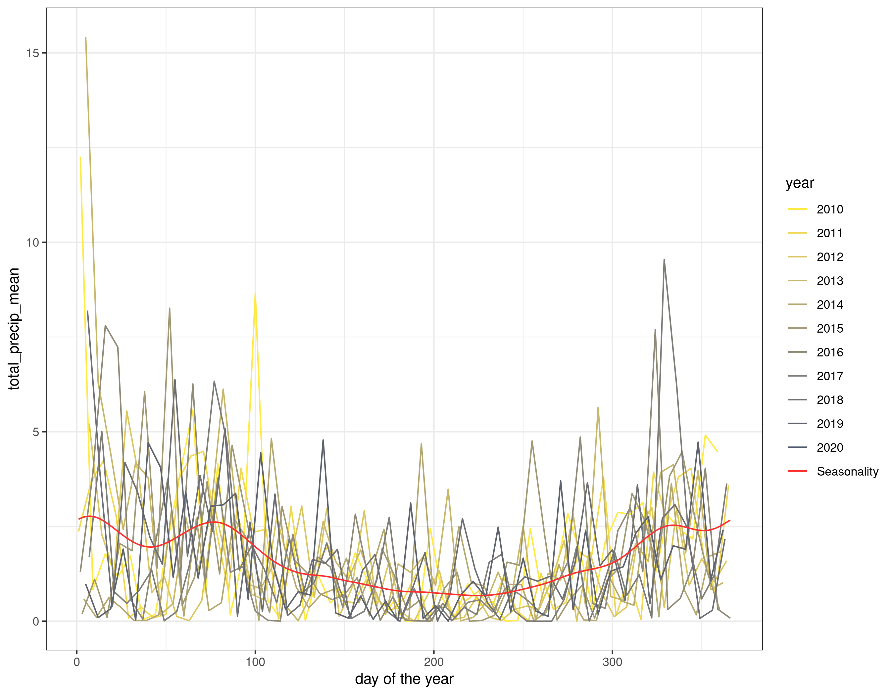
```

---

## Surrogating testing

Now we want to find where in the time for prediction $tp$ the original driver is most significant causal:

 - Apply CCM on the 500 surrogates and the Original time series for various $tp$ values
 
 - Where the Original driver time series is above the 95th percentile of the distribution it causally significant

---

```{r rj-boxplot-tps, echo=FALSE, message=FALSE, warning=FALSE, out.width=800, fig.align='center'}
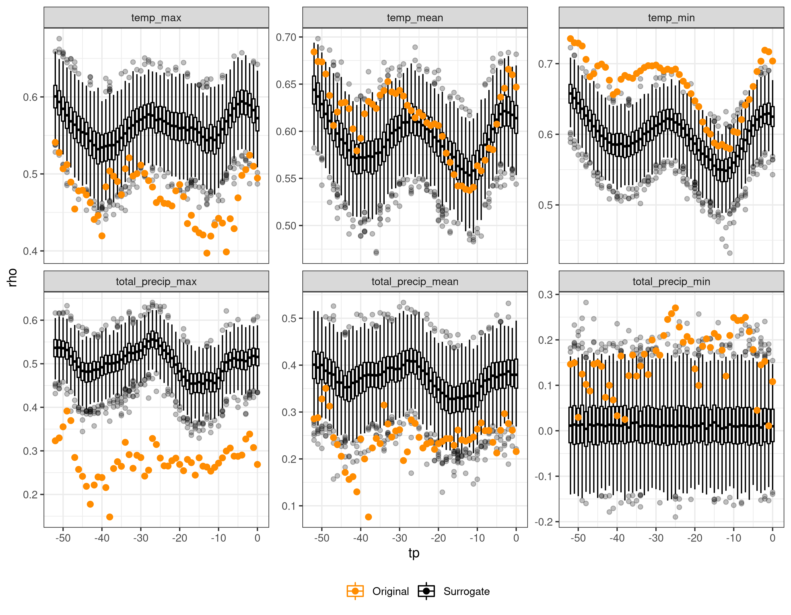
```

---

```{r rj-boxplot-sig, echo=FALSE, message=FALSE, warning=FALSE, out.width=800, fig.align='center'}
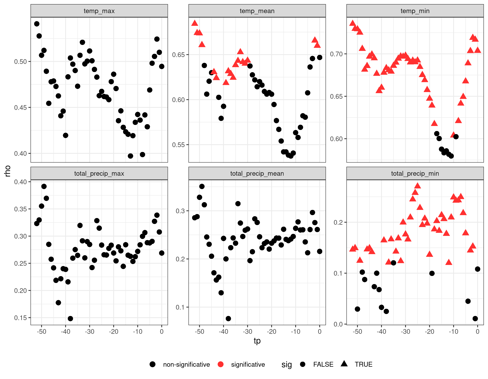
```

---

## Force of Interaction

With the at the time for prediction where the original driver is causal significant and where it is has the greater $\rho$ we estimate the force of interaction:

 - With the drivers that are most significant and for the $tp$ which is has highest $\rho$ form a dataset
 
 - Using the S-Map algorithm, we estimate the effect of the driver, at the $tp$, on the time series of Cases

---

## Force of Interaction
 
The S-Map has the following formula, which it is a Singular Value Decomposition (SVD) algorithm:

$$
\begin{equation}
y(t) = \mathbf{C_0} + \sum_{i=1}^{I} \mathbf{C_i}(t) x_i(t),
\end{equation}
$$

Where $I$ is until the drivers we found as significant causal on the Cases time series. We choose the minimum value of Mean Absolute Error (MAE), between predictions and observations given by the S-Map for $\theta$. Where $C_i$ are weights to pounder how great are the influences of each nearby point on the predicted point.

---

## Theta form

$\theta$ it is the locally weighted kernel to the decay of influence of each point considered into the prediction, with the formula: 

$$C_i = \exp^{-\theta\frac{\|x(t_k) - x(t)\|}{d}}$$

If $\theta$ is $0$ or close to $0$ the model understand the influence of each driver as linear, as $\theta$ grows the model gives more non-linearity weight to each of the drivers.

---

```{r theta, echo=FALSE, message=FALSE, warning=FALSE, out.width=750, fig.align='center'}
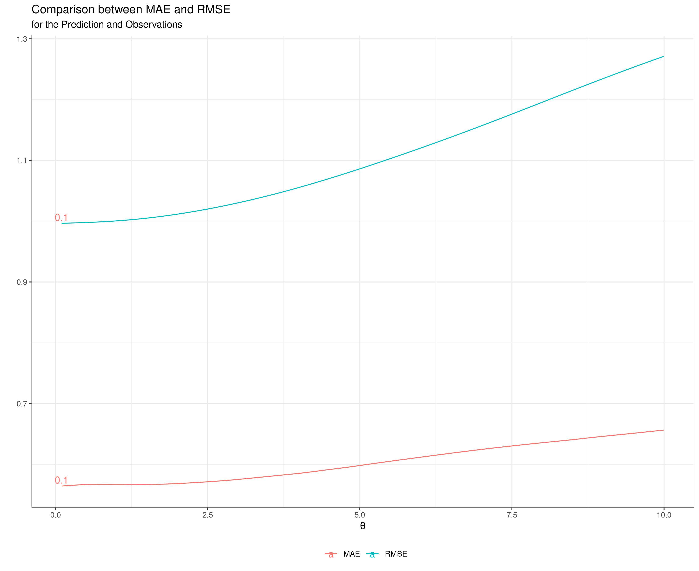
```

---

## Theta choice

With the value of theta for the minimum on MAE, we can now estimate the forces of interaction, $C_i(t)$ for each drivers ( $T_{min}$, $Precip_{min}$, $T_{mean}$ ) on the the effect:

$$
\begin{equation}
Cases(t) = C_0(t) + \frac{\partial T_{min}(t - 52)}{\partial Cases(t)}T_{min}(t - 52) + \frac{\partial T_{mean}(t - 52)}{\partial Cases(t)}T_{mean}(t - 52) + \\
\frac{\partial Precip_{min}(t - 25 )}{\partial Cases(t)}Precip_{min}(t - 25)
\end{equation}
$$

---

```{r forces, echo=FALSE, message=FALSE, warning=FALSE, out.width=750, fig.align='center'}
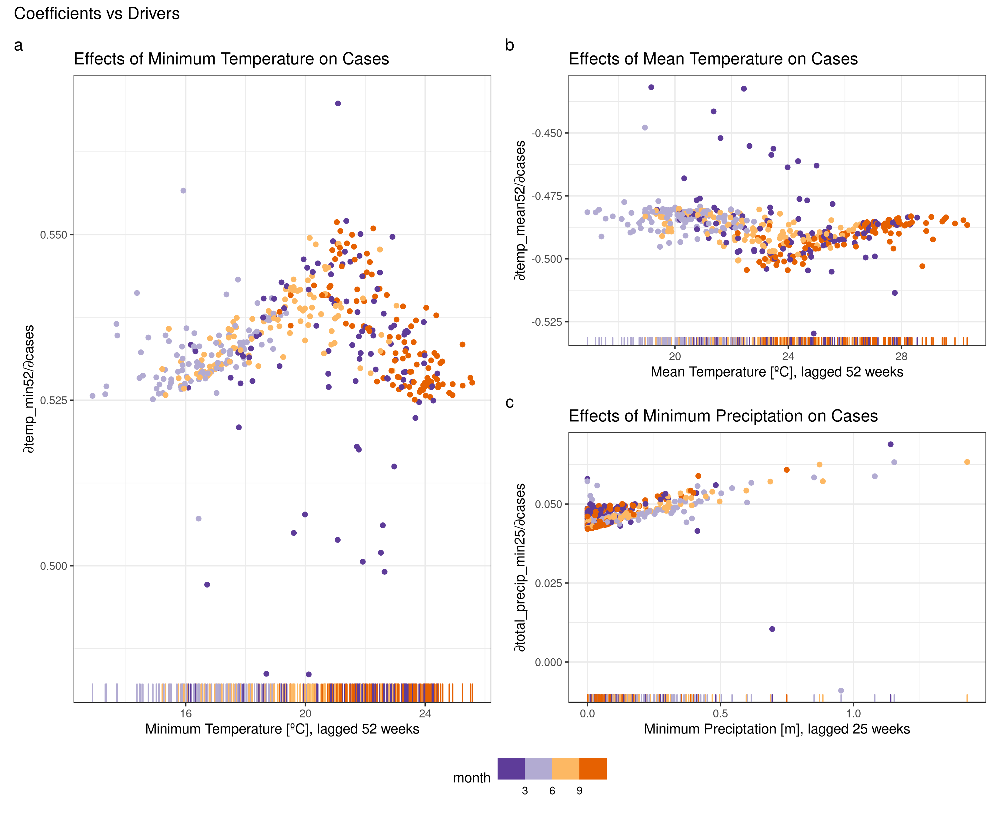
```

---

```{r forces-ts, echo=FALSE, message=FALSE, warning=FALSE, out.width=750, fig.align='center'}
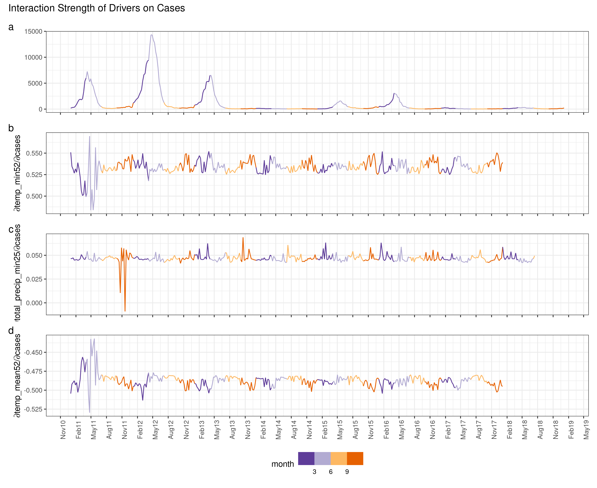
```

---

```{r forces-ts-zoom, echo=FALSE, message=FALSE, warning=FALSE, out.width=750, fig.align='center'}
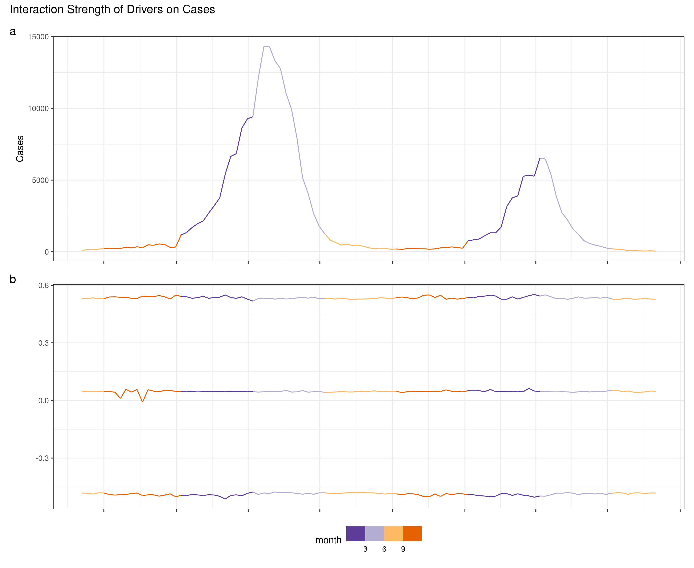
```


---

## Conclusion & Interpretation

 * __Minimum Temperature__, __Mean Temperature__ and __Minimum Preciptation__ are climate drivers of Cases at Rio de Janeiro city 

 * __Minimum Temperature__ has an lagged effect on cases of 2 weeks, this is related to shortening of Extrinsic Incubation period, always positive and above suitable temperature for transmission.
 
 * __Mean Temperature__ has no lagged effect on cases, always negative effect, probably related with non suited temperatures for the mosquito, very prolonged extrinsic incubation period as well as prolonged gonotrophic developement.

 * __Minimum Precipation__ has a lagged effect on cases of 1 week, sometimes negative sometimes positive, probably a always present driver factor, but only favoring the transmission on the __Minimum Temperature__ is suited.
 
---

class: middle, center

# Thank You!
# ¡Gracias!
# Obrigado!

`r fontawesome::fa("github")` GitHub: [https://github.com/rafalopespx/](https://github.com/rafalopespx/)
`r fontawesome::fa("mail-bulk")`  [lopes1313@gmail.com](mailto:lopes1313@gmail.com)
`r fontawesome::fa("twitter")` Twitter: [@rafalpx](www.twitter.com/rafalpx)

---

```{r forces-int, echo=FALSE, message=FALSE, warning=FALSE, out.width=750, fig.align='center'}
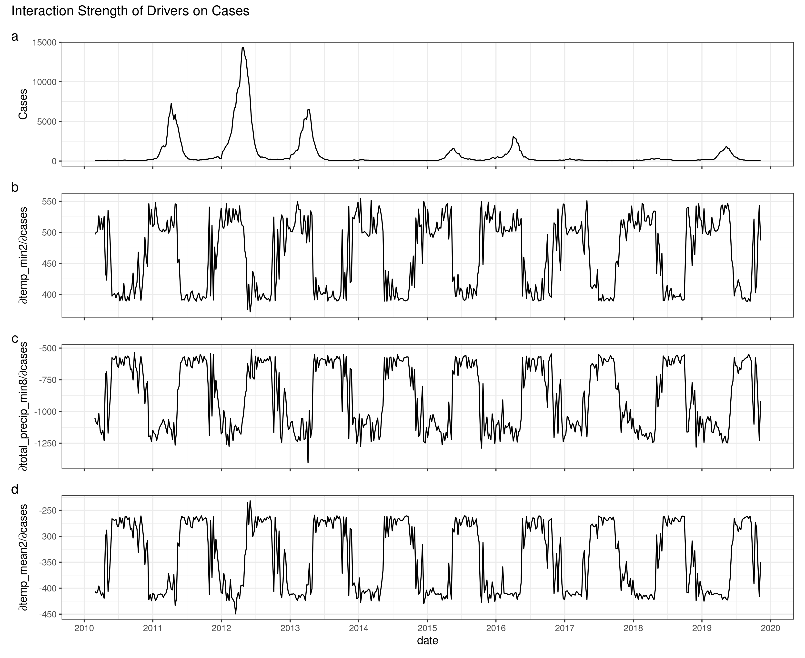
```

